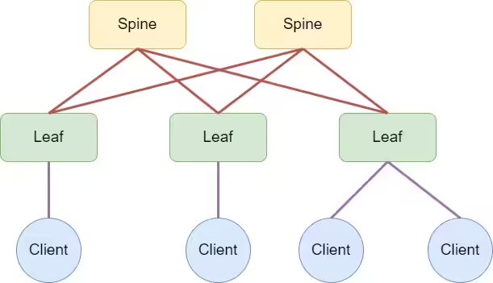
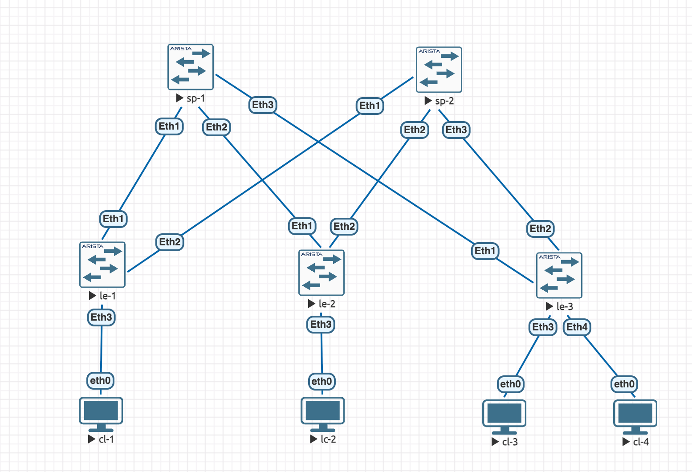

### Проектирование адресного пространства

### Цель
Cобрать схему CLOS и распределить адресное пространство

### Шаги
1. Соберете топологию CLOS, как на схеме:



2. Распределите адресное пространство для Underlay сети
3. Зафиксируете в документации план работ, адресное пространство, схему сети, настройки (если перенесли на оборудование)

### Ход выполнения
#### 1. Собрана схема
В EVE-NG были добавлены образы Arista EOS version: 4.29.2F, собрана схема топологии CLOS согласно схеме из примера



#### 2. Произведена начальная настройка свитчей

Заданы hostname а так же любимые alias
```
hostname le-1
alias c configure terminal
alias ii show interfaces descr
```

#### 3. Произведена начальная настройка клиентов
```
VPCS> set pcname cl-1

cl-1> ip 192.168.3.1 255.255.255.0
Checking for duplicate address...
cl-1 : 192.168.3.1 255.255.255.0
```
#### 4 IP PLAN underlay сети

На каждом линке настраиваем p2p /31 сеть. Верхний адрес из сети на spine, нижний на leaf

IP = 10.Dn.Sn.X/31, где:
Dn – номер ЦОДа,
Sn – номер spine,
X – значение по порядку,

Dn для DC1 = 0 – 7, где
0 – loopback1
1 – loopback2
2 – p2p links
3 – reserved
4-7 – services


#### 5. Сводная таблица заданный IP адресов
|Device|Interface|IP Address/Subnet Mask
|---|---|---|
sp-1|Ethernet1|10.2.1.0/31
-|Ethernet2|10.2.1.2/31
-|Ethernet3|10.2.1.4/31
sp-2|Ethernet1|10.2.2.0/31
-|Ethernet2|10.2.2.2/31
-|Ethernet3|10.2.2.4/31
le-1|Ethernet1|10.2.1.1/31
-|Ethernet2|10.2.2.1/31
le-2|Ethernet1|10.2.1.3/31
-|Ethernet2|10.2.2.3/31
le-3|Ethernet1|10.2.1.5/31
-|Ethernet2|10.2.2.5/31
cl-1|NIC|192.168.3.1/24|
cl-2|NIC|192.168.3.2/24|
cl-3|NIC|192.168.3.3/24|
cl-4|NIC|192.168.3.4/24|

### 6. Проверка доступности

#### Первый спайн
```
sp-1#sh ip int br
                                                                        Address
Interface        IP Address       Status      Protocol           MTU    Owner
---------------- ---------------- ----------- -------------- ---------- -------
Ethernet1        10.2.1.0/31      up          up                1500
Ethernet2        10.2.1.2/31      up          up                1500
Ethernet3        10.2.1.4/31      up          up                1500
Management1      unassigned       up          up                1500

sp-1#bash

Arista Networks EOS shell

[admin@sp-1 ~]$ sudo ping -c 2 10.2.1.1
PING 10.2.1.1 (10.2.1.1) 56(84) bytes of data.
64 bytes from 10.2.1.1: icmp_seq=1 ttl=64 time=6.29 ms
64 bytes from 10.2.1.1: icmp_seq=2 ttl=64 time=5.24 ms

--- 10.2.1.1 ping statistics ---
2 packets transmitted, 2 received, 0% packet loss, time 1002ms
rtt min/avg/max/mdev = 5.241/5.768/6.295/0.527 ms
[admin@sp-1 ~]$
[admin@sp-1 ~]$ sudo ping -c 2 10.2.1.3
PING 10.2.1.3 (10.2.1.3) 56(84) bytes of data.
64 bytes from 10.2.1.3: icmp_seq=1 ttl=64 time=6.04 ms
64 bytes from 10.2.1.3: icmp_seq=2 ttl=64 time=5.51 ms

--- 10.2.1.3 ping statistics ---
2 packets transmitted, 2 received, 0% packet loss, time 1002ms
rtt min/avg/max/mdev = 5.512/5.779/6.047/0.278 ms
[admin@sp-1 ~]$
[admin@sp-1 ~]$ sudo ping -c 2 10.2.1.5
PING 10.2.1.5 (10.2.1.5) 56(84) bytes of data.
64 bytes from 10.2.1.5: icmp_seq=1 ttl=64 time=7.52 ms
64 bytes from 10.2.1.5: icmp_seq=2 ttl=64 time=5.10 ms

--- 10.2.1.5 ping statistics ---
2 packets transmitted, 2 received, 0% packet loss, time 1001ms
rtt min/avg/max/mdev = 5.107/6.316/7.526/1.212 ms
[admin@sp-1 ~]$
```

#### Первый спайн
```
sp-2#sh ip int br
                                                                        Address
Interface        IP Address       Status      Protocol           MTU    Owner
---------------- ---------------- ----------- -------------- ---------- -------
Ethernet1        10.2.2.0/31      up          up                1500
Ethernet2        10.2.2.2/31      up          up                1500
Ethernet3        10.2.2.4/31      up          up                1500
Management1      unassigned       up          up                1500

sp-2#bash

Arista Networks EOS shell

[admin@sp-2 ~]$ sudo ping -c 2 10.2.2.1
PING 10.2.2.1 (10.2.2.1) 56(84) bytes of data.
64 bytes from 10.2.2.1: icmp_seq=1 ttl=64 time=7.47 ms
64 bytes from 10.2.2.1: icmp_seq=2 ttl=64 time=4.73 ms

--- 10.2.2.1 ping statistics ---
2 packets transmitted, 2 received, 0% packet loss, time 1002ms
rtt min/avg/max/mdev = 4.736/6.105/7.475/1.371 ms
[admin@sp-2 ~]$ sudo ping -c 2 10.2.2.3
PING 10.2.2.3 (10.2.2.3) 56(84) bytes of data.
64 bytes from 10.2.2.3: icmp_seq=1 ttl=64 time=5.72 ms
64 bytes from 10.2.2.3: icmp_seq=2 ttl=64 time=6.47 ms

--- 10.2.2.3 ping statistics ---
2 packets transmitted, 2 received, 0% packet loss, time 1001ms
rtt min/avg/max/mdev = 5.721/6.098/6.476/0.385 ms
[admin@sp-2 ~]$ sudo ping -c 2 10.2.2.5
PING 10.2.2.5 (10.2.2.5) 56(84) bytes of data.
64 bytes from 10.2.2.5: icmp_seq=1 ttl=64 time=7.14 ms
64 bytes from 10.2.2.5: icmp_seq=2 ttl=64 time=6.10 ms

--- 10.2.2.5 ping statistics ---
2 packets transmitted, 2 received, 0% packet loss, time 1002ms
rtt min/avg/max/mdev = 6.109/6.624/7.140/0.521 ms
[admin@sp-2 ~]$
```

### Листинг конфигов устроств

#### sp-1
```
! Command: show running-config
! device: sp-1 (vEOS-lab, EOS-4.29.2F)
!
! boot system flash:/vEOS-lab.swi
!
no aaa root
!
alias c configure terminal
alias ii show interfaces descr
!
transceiver qsfp default-mode 4x10G
!
service routing protocols model ribd
!
hostname sp-1
!
spanning-tree mode mstp
!
vlan 1001
!
interface Ethernet1
   description 1@le-1
   no switchport
   ip address 10.2.1.0/31
!
interface Ethernet2
   description 1@le-2
   no switchport
   ip address 10.2.1.2/31
!
interface Ethernet3
   description 1@le-3
   no switchport
   ip address 10.2.1.4/31
!
interface Ethernet4
   shutdown
!
interface Ethernet5
   shutdown
!
interface Ethernet6
   shutdown
!
interface Ethernet7
   shutdown
!
interface Ethernet8
   shutdown
!
interface Management1
!
no ip routing
!
end
```

#### sp-2
```
! Command: show running-config
! device: sp-2 (vEOS-lab, EOS-4.29.2F)
!
! boot system flash:/vEOS-lab.swi
!
no aaa root
!
alias c configure terminal
alias ii show interfaces descr
!
transceiver qsfp default-mode 4x10G
!
service routing protocols model ribd
!
hostname sp-2
!
spanning-tree mode mstp
!
interface Ethernet1
   description 2@le-1
   no switchport
   ip address 10.2.2.0/31
!
interface Ethernet2
   description 2@le-2
   no switchport
   ip address 10.2.2.2/31
!
interface Ethernet3
   description 2@le-3
   no switchport
   ip address 10.2.2.4/31
!
interface Ethernet4
   shutdown
!
interface Ethernet5
   shutdown
!
interface Ethernet6
   shutdown
!
interface Ethernet7
   shutdown
!
interface Ethernet8
   shutdown
!
interface Management1
!
no ip routing
!
end
```

#### le-1
```

! Command: show running-config
! device: le-1 (vEOS-lab, EOS-4.29.2F)
!
! boot system flash:/vEOS-lab.swi
!
no aaa root
!
username cam privilege 15 secret sha512 $6$4yzDxbKRdVgDWxgZ$I3sSbpAwrADog6IjHCi6bFk0QjZzT2sQwGbE2RgmPdgTu.mzEIg8pwyw4N4dSaeRhreWDs2/mE6svAewd/PK..
!
alias c configure terminal
alias ii show interfaces descr
!
transceiver qsfp default-mode 4x10G
!
service routing protocols model ribd
!
hostname le-1
!
spanning-tree mode mstp
!
vlan 1001
!
aaa authorization exec default local
!
interface Ethernet1
   description 1@sp-1
   no switchport
   ip address 10.2.1.1/31
!
interface Ethernet2
   description 1@sp-2
   no switchport
   ip address 10.2.2.1/31
!
interface Ethernet3
   description eth0@cl-1
!
interface Ethernet4
   shutdown
!
interface Ethernet5
   shutdown
!
interface Ethernet6
   shutdown
!
interface Ethernet7
   shutdown
!
interface Ethernet8
   shutdown
!
interface Management1
!
no ip routing
!
end
```

#### le-2
```

! Command: show running-config
! device: le-2 (vEOS-lab, EOS-4.29.2F)
!
! boot system flash:/vEOS-lab.swi
!
no aaa root
!
alias c configure terminal
alias ii show interfaces descr
!
transceiver qsfp default-mode 4x10G
!
service routing protocols model ribd
!
hostname le-2
!
spanning-tree mode mstp
!
interface Ethernet1
   description 2@sp-1
   no switchport
   ip address 10.2.1.3/31
!
interface Ethernet2
   description 2@sp-2
   no switchport
   ip address 10.2.2.3/31
!
interface Ethernet3
   description eth0@cl-2
!
interface Ethernet4
   shutdown
!
interface Ethernet5
   shutdown
!
interface Ethernet6
   shutdown
!
interface Ethernet7
   shutdown
!
interface Ethernet8
   shutdown
!
interface Management1
!
no ip routing
!
end
```

#### le-3
```

! Command: show running-config
! device: le-3 (vEOS-lab, EOS-4.29.2F)
!
! boot system flash:/vEOS-lab.swi
!
no aaa root
!
alias c configure terminal
alias ii show interfaces descr
!
transceiver qsfp default-mode 4x10G
!
service routing protocols model ribd
!
hostname le-3
!
spanning-tree mode mstp
!
interface Ethernet1
   description 3@sp-1
   no switchport
   ip address 10.2.1.5/31
!
interface Ethernet2
   description 3@sp-2
   no switchport
   ip address 10.2.2.5/31
!
interface Ethernet3
   description eth0@cl-3
!
interface Ethernet4
   description eth0@cl-4
!
interface Ethernet5
   shutdown
!
interface Ethernet6
   shutdown
!
interface Ethernet7
   shutdown
!
interface Ethernet8
   shutdown
!
interface Management1
!
no ip routing
!
end
```