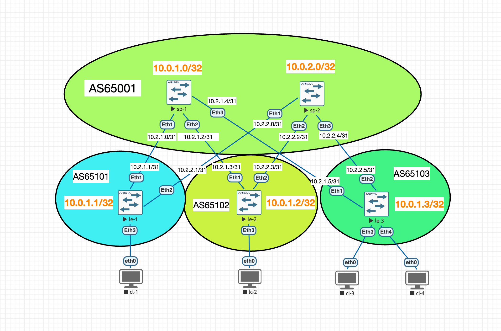

### VxLAN L3VNI


### Цель

Настроить маршрутизацию в рамках Overlay между клиентами.

### Шаги
1. Настроите каждого клиента в своем VNI
2. Настроите маршрутизацию между клиентами.
3. Зафиксируете в документации - план работы, адресное пространство, схему сети, конфигурацию устройств


### Ход выполнения

#### 1. Используем схему из [лабораторной работы #5](../lab-05/)


Для удобства возьмём схему из прошлой лабы, у нас там уже есть underlay BGP v4 + overlay BGP evpn + L2 VNI.
Добавим ещё один влан и клиентов в нём, чтобы настроить маршрутизацию между VNI. Так же для удобства заменим сети у клиентов, чтобы было проще ориентироваться в них.

| VLAN |    RT    |      GW/MASK    |
|------|----------|-----------------|
|  10  | 10:10010 | 192.168.10.1/24 |
|  20  | 20:10020 | 192.168.20.1/24 |


| client | VLAN |      IP/MASK     |
|--------|------|------------------|
|  cl-1  |  10  | 192.168.10.11/24 |
|  cl-2  |  10  | 192.168.10.12/24 |
|  cl-3  |  10  | 192.168.10.13/24 |
|  cl-11 |  20  | 192.168.20.11/24 |
|  cl-22 |  20  | 192.168.20.12/24 |
|  cl-33 |  20  | 192.168.20.13/24 |

Добавим IP на клиенты
```
cl-11> ip 192.168.20.12/24 192.168.10.1
```

Настроим порт и влан 20 на всех лифах:
```
int Et4
no shutdown
description eth0@cl-11
switchport mode access
switchport access vlan 20
! Access VLAN does not exist. Creating vlan 20
```

Добавим evpn instance для VLAN 20 на всех лифах

```
router bgp 65101
   vlan 20
      rd 10.0.1.1:10020
      route-target both 20:10020
      redistribute learned
```

Убедимся в налиции полной L2 связности с обоих клиентов лифа le-3:

cl-3
```
cl-3> ping 192.168.10.11

84 bytes from 192.168.10.11 icmp_seq=1 ttl=64 time=19.887 ms
84 bytes from 192.168.10.11 icmp_seq=2 ttl=64 time=17.748 ms
84 bytes from 192.168.10.11 icmp_seq=3 ttl=64 time=20.636 ms
84 bytes from 192.168.10.11 icmp_seq=4 ttl=64 time=17.170 ms
84 bytes from 192.168.10.11 icmp_seq=5 ttl=64 time=21.963 ms

cl-3> ping 192.168.10.12

84 bytes from 192.168.10.12 icmp_seq=1 ttl=64 time=81.122 ms
84 bytes from 192.168.10.12 icmp_seq=2 ttl=64 time=18.772 ms
84 bytes from 192.168.10.12 icmp_seq=3 ttl=64 time=24.207 ms
84 bytes from 192.168.10.12 icmp_seq=4 ttl=64 time=20.774 ms
84 bytes from 192.168.10.12 icmp_seq=5 ttl=64 time=19.703 ms

cl-3>
```

cl-33
```
cl-33> ping 192.168.20.11

84 bytes from 192.168.20.11 icmp_seq=1 ttl=64 time=22.850 ms
84 bytes from 192.168.20.11 icmp_seq=2 ttl=64 time=17.640 ms
84 bytes from 192.168.20.11 icmp_seq=3 ttl=64 time=19.446 ms
84 bytes from 192.168.20.11 icmp_seq=4 ttl=64 time=18.212 ms
84 bytes from 192.168.20.11 icmp_seq=5 ttl=64 time=17.153 ms

cl-33> ping 192.168.20.12

84 bytes from 192.168.20.12 icmp_seq=1 ttl=64 time=20.567 ms
84 bytes from 192.168.20.12 icmp_seq=2 ttl=64 time=17.077 ms
84 bytes from 192.168.20.12 icmp_seq=3 ttl=64 time=17.941 ms
84 bytes from 192.168.20.12 icmp_seq=4 ttl=64 time=16.448 ms
84 bytes from 192.168.20.12 icmp_seq=5 ttl=64 time=15.890 ms

cl-33>
```

Зафиксируем итоговую схему после добавления новых клиентов


#### 2. Настроим маршрутизацию между клиентами.
##### Краткий план

1. Добавить на каждый лиф anycast gateway
2. Добавить L3VNI
3. Проверить связность

##### 1. Добавляем на каждый лиф anycast gateway и VRF

Добавим в конфигурацию лифок
```
vrf instance TENANT-1
exit
ip routing vrf TENANT-1
ip virtual-router mac-address 00:00:be:ef:ca:fe
interface vlan 10
vrf TENANT-1
ip address virtual 192.168.10.1/24

interface vlan 20
vrf TENANT-1
ip address virtual 192.168.20.1/24
end
```

\* В процессе, после добавления данной конфирурации только на le-1 уже было видно, что на клиентах с других лифов маршрутизация между вланами заработала. Вероятно причина в том, что vni растянуты на всех лифах и трафик маршрутизировался на le-1. Попробовал попрописывать разные маки на virtual-router и поудалять шлюз с лифа - убедился, что после очистки arp на клиенте хост из другого влана снова начинает пинговаться, но arp шлюза становится другим. Если прописать везде одинаковый virtual-router mac-address и совершить то же действие (удаление шлюза с лифа к которому подключен тестируемый клиент), то пинг восстанавливается сам, без очистки arp таблицы.

Мы прописали на всех лифах необходимую конфигурацию. Проверим, что cl-33 видит хосты из другого влана (в том числе подключенные к другим лифам):

```
cl-33> ping  192.168.10.12 -c 2

84 bytes from 192.168.10.12 icmp_seq=1 ttl=63 time=21.252 ms
84 bytes from 192.168.10.12 icmp_seq=2 ttl=63 time=18.799 ms

cl-33> ping  192.168.10.11 -c 2

84 bytes from 192.168.10.11 icmp_seq=1 ttl=63 time=413.349 ms
84 bytes from 192.168.10.11 icmp_seq=2 ttl=63 time=41.536 ms

cl-33> ping  192.168.10.13 -c 2

84 bytes from 192.168.10.13 icmp_seq=1 ttl=63 time=255.850 ms
84 bytes from 192.168.10.13 icmp_seq=2 ttl=63 time=7.714 ms

cl-33>
```

Не смотря на то, что мы ещё не прописали L3VNI маршрутизация уже работает. Получается, что на данном шаге мы собрали схему Asymmetric IRB. Для его работы нужно чтобы на каждом лифе были прописаны все vni. Попробуем с le-3 убрать всё, что относится к влан 10. Очевидно что при такой схеме cl-33 перестанет пинговать 192.168.10.12 и 192.168.10.11 и снова сможет только после добавления L3VNI.


Удалим VNI vlan 10 и шлюз

```
le-3#c
le-3(config)#router bgp 65103
le-3(config-router-bgp)#no    vlan 10
```
и шлюз
```
le-3(config)#no interface Vlan10
```

После удаления пинг сразу же исчез

```
cl-33> ping  192.168.10.12 -c 2

192.168.10.12 icmp_seq=1 timeout
192.168.10.12 icmp_seq=2 timeout
```


##### 2. Добавляем L3VNI

```
router bgp 65102
   vrf TENANT-1
      rd 10.0.1.2:50000
      route-target import evpn 50000:50000
      route-target export evpn 50000:50000
      redistribute connected

interface Vxlan1
vxlan vrf TENANT-1 vni 50000
```

##### 3. Проверяем связность

Проверим что каждый клиент из VLAN 10 пингует всех 3х клиентов из соседнего VLAN 20 и одного соседа из своего же влана:

cl-1
```
cl-1> ping 192.168.20.12 -c 2

84 bytes from 192.168.20.12 icmp_seq=1 ttl=62 time=491.862 ms
84 bytes from 192.168.20.12 icmp_seq=2 ttl=62 time=21.342 ms

cl-1> ping 192.168.20.13 -c 2

84 bytes from 192.168.20.13 icmp_seq=1 ttl=62 time=42.025 ms
84 bytes from 192.168.20.13 icmp_seq=2 ttl=62 time=21.580 ms

cl-1> ping 192.168.20.11 -c 2

84 bytes from 192.168.20.11 icmp_seq=1 ttl=63 time=90.809 ms
84 bytes from 192.168.20.11 icmp_seq=2 ttl=63 time=8.081 ms

cl-1> ping 192.168.10.12 -c 2

84 bytes from 192.168.10.12 icmp_seq=1 ttl=64 time=30.966 ms
84 bytes from 192.168.10.12 icmp_seq=2 ttl=64 time=20.887 ms

cl-1>
```

cl-2
```
cl-2> ping 192.168.20.11 -c 2

84 bytes from 192.168.20.11 icmp_seq=1 ttl=62 time=25.064 ms
84 bytes from 192.168.20.11 icmp_seq=2 ttl=62 time=20.914 ms

cl-2> ping 192.168.20.12 -c 2

84 bytes from 192.168.20.12 icmp_seq=1 ttl=63 time=8.316 ms
84 bytes from 192.168.20.12 icmp_seq=2 ttl=63 time=7.802 ms

cl-2> ping 192.168.20.13 -c 2

84 bytes from 192.168.20.13 icmp_seq=1 ttl=62 time=18.887 ms
84 bytes from 192.168.20.13 icmp_seq=2 ttl=62 time=23.571 ms

cl-2> ping 192.168.10.11 -c 2

84 bytes from 192.168.10.11 icmp_seq=1 ttl=64 time=18.518 ms
84 bytes from 192.168.10.11 icmp_seq=2 ttl=64 time=16.229 ms

cl-2>
```

cl-3 мы выключили для тестов, так что проверим со ворого клиента этого лифа cl-33:

```
cl-33> ping  192.168.10.12 -c 2

84 bytes from 192.168.10.12 icmp_seq=1 ttl=62 time=40.823 ms
84 bytes from 192.168.10.12 icmp_seq=2 ttl=62 time=74.082 ms

cl-33> ping  192.168.10.11 -c 2

84 bytes from 192.168.10.11 icmp_seq=1 ttl=62 time=33.565 ms
84 bytes from 192.168.10.11 icmp_seq=2 ttl=62 time=23.465 ms

cl-33> ping  192.168.20.11 -c 2

84 bytes from 192.168.20.11 icmp_seq=1 ttl=64 time=22.862 ms
84 bytes from 192.168.20.11 icmp_seq=2 ttl=64 time=23.110 ms

cl-33>
```


Таблица со спайна sp-1
```
sp-1#show bgp evpn
BGP routing table information for VRF default
Router identifier 10.0.1.0, local AS number 65001
Route status codes: * - valid, > - active, S - Stale, E - ECMP head, e - ECMP
                    c - Contributing to ECMP, % - Pending BGP convergence
Origin codes: i - IGP, e - EGP, ? - incomplete
AS Path Attributes: Or-ID - Originator ID, C-LST - Cluster List, LL Nexthop - Link Local Nexthop

          Network                Next Hop              Metric  LocPref Weight  Path
 * >      RD: 10.0.1.2:10010 mac-ip 0050.7966.6808
                                 10.0.1.2              -       100     0       65102 i
 * >      RD: 10.0.1.2:10010 mac-ip 0050.7966.6808 192.168.10.12
                                 10.0.1.2              -       100     0       65102 i
 * >      RD: 10.0.1.3:10020 mac-ip 0050.7966.680a
                                 10.0.1.3              -       100     0       65103 i
 * >      RD: 10.0.1.3:10020 mac-ip 0050.7966.680a 192.168.20.13
                                 10.0.1.3              -       100     0       65103 i
 * >      RD: 10.0.1.1:10010 imet 10.0.1.1
                                 10.0.1.1              -       100     0       65101 i
 * >      RD: 10.0.1.1:10020 imet 10.0.1.1
                                 10.0.1.1              -       100     0       65101 i
 * >      RD: 10.0.1.2:10010 imet 10.0.1.2
                                 10.0.1.2              -       100     0       65102 i
 * >      RD: 10.0.1.2:10020 imet 10.0.1.2
                                 10.0.1.2              -       100     0       65102 i
 * >      RD: 10.0.1.3:10020 imet 10.0.1.3
                                 10.0.1.3              -       100     0       65103 i
 * >      RD: 10.0.1.1:50000 ip-prefix 192.168.10.0/24
                                 10.0.1.1              -       100     0       65101 i
 * >      RD: 10.0.1.2:50000 ip-prefix 192.168.10.0/24
                                 10.0.1.2              -       100     0       65102 i
 * >      RD: 10.0.1.1:50000 ip-prefix 192.168.20.0/24
                                 10.0.1.1              -       100     0       65101 i
 * >      RD: 10.0.1.2:50000 ip-prefix 192.168.20.0/24
                                 10.0.1.2              -       100     0       65102 i
 * >      RD: 10.0.1.3:50000 ip-prefix 192.168.20.0/24
                                 10.0.1.3              -       100     0       65103 i

```

Таблица c лифа le-1
```
le-1#show bgp evpn
BGP routing table information for VRF default
Router identifier 10.0.1.1, local AS number 65101
Route status codes: * - valid, > - active, S - Stale, E - ECMP head, e - ECMP
                    c - Contributing to ECMP, % - Pending BGP convergence
Origin codes: i - IGP, e - EGP, ? - incomplete
AS Path Attributes: Or-ID - Originator ID, C-LST - Cluster List, LL Nexthop - Link Local Nexthop

          Network                Next Hop              Metric  LocPref Weight  Path
 * >      RD: 10.0.1.1:10010 imet 10.0.1.1
                                 -                     -       -       0       i
 * >      RD: 10.0.1.1:10020 imet 10.0.1.1
                                 -                     -       -       0       i
 * >Ec    RD: 10.0.1.2:10010 imet 10.0.1.2
                                 10.0.1.2              -       100     0       65001 65102 i
 *  ec    RD: 10.0.1.2:10010 imet 10.0.1.2
                                 10.0.1.2              -       100     0       65001 65102 i
 * >Ec    RD: 10.0.1.2:10020 imet 10.0.1.2
                                 10.0.1.2              -       100     0       65001 65102 i
 *  ec    RD: 10.0.1.2:10020 imet 10.0.1.2
                                 10.0.1.2              -       100     0       65001 65102 i
 * >Ec    RD: 10.0.1.3:10020 imet 10.0.1.3
                                 10.0.1.3              -       100     0       65001 65103 i
 *  ec    RD: 10.0.1.3:10020 imet 10.0.1.3
                                 10.0.1.3              -       100     0       65001 65103 i
 * >      RD: 10.0.1.1:50000 ip-prefix 192.168.10.0/24
                                 -                     -       -       0       i
 * >Ec    RD: 10.0.1.2:50000 ip-prefix 192.168.10.0/24
                                 10.0.1.2              -       100     0       65001 65102 i
 *  ec    RD: 10.0.1.2:50000 ip-prefix 192.168.10.0/24
                                 10.0.1.2              -       100     0       65001 65102 i
 * >      RD: 10.0.1.1:50000 ip-prefix 192.168.20.0/24
                                 -                     -       -       0       i
 * >Ec    RD: 10.0.1.2:50000 ip-prefix 192.168.20.0/24
                                 10.0.1.2              -       100     0       65001 65102 i
 *  ec    RD: 10.0.1.2:50000 ip-prefix 192.168.20.0/24
                                 10.0.1.2              -       100     0       65001 65102 i
 * >Ec    RD: 10.0.1.3:50000 ip-prefix 192.168.20.0/24
                                 10.0.1.3              -       100     0       65001 65103 i
 *  ec    RD: 10.0.1.3:50000 ip-prefix 192.168.20.0/24
                                 10.0.1.3              -       100     0       65001 65103 i
le-1#
```


### Листинг конфигов устройств

Конфигурации устройств находятся в папке [configs](configs/).

#### TODO
