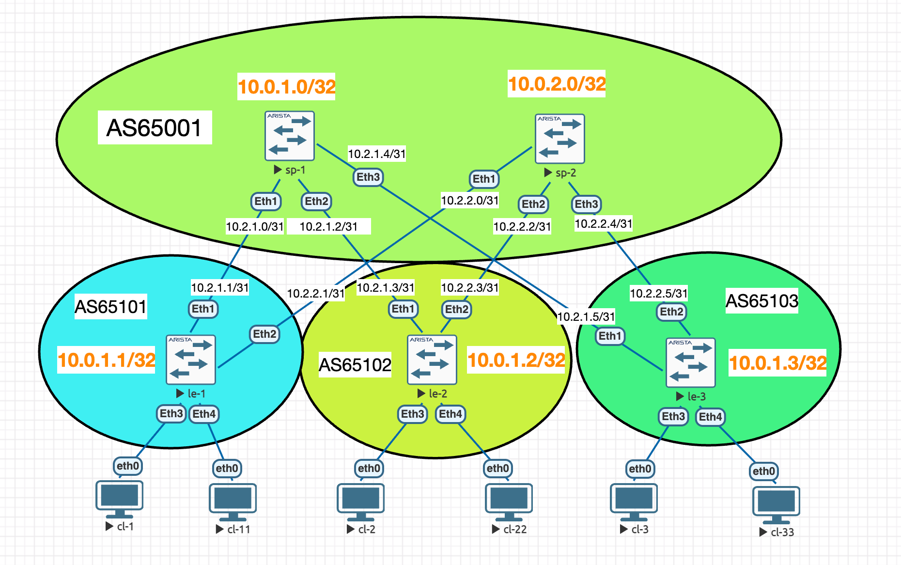
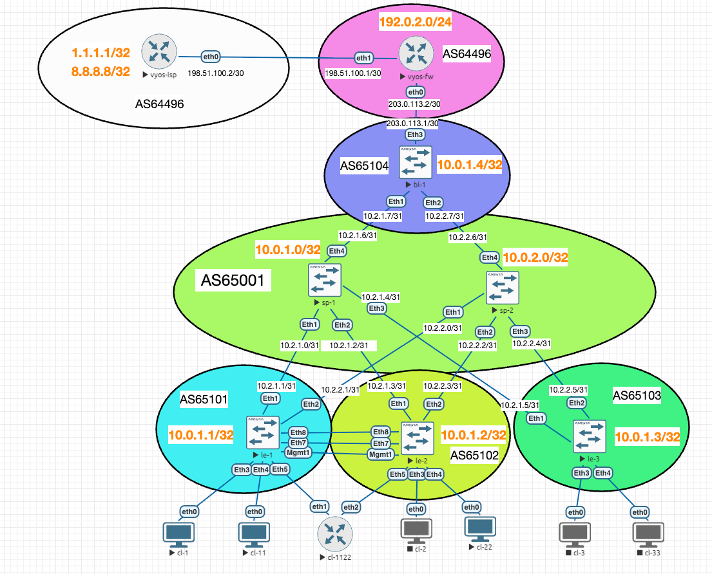

# Разработка сети датацентра на основе технологии VXLAN EVPN

## Цель проекта

Разработать и смоделировать сеть датацентра на базе архитектуры leaf-spine с использованием VXLAN EVPN. В минимальном варианте проект должен обеспечить L2-связность внутри клиентских VLAN, L3-маршрутизацию между VLAN через L3VNI, распределенный шлюз Anycast Gateway и выход tenant-сетей во внешний сегмент через border leaf и VyOS router/firewall с NAT.

## Постановка задачи

В классической сети датацентра расширение L2-сегментов, миграция сервисов и масштабирование клиентских сетей часто требуют ручного протягивания VLAN через большое количество устройств. Это усложняет эксплуатацию, повышает риск ошибки и плохо масштабируется при росте количества стоек, клиентов и площадок.

VXLAN EVPN позволяет отделить физическую underlay-сеть от логической overlay-сети. Underlay отвечает за IP-достижимость между VTEP, а overlay предоставляет клиентские L2/L3-сервисы поверх fabric. Такой подход упрощает масштабирование, позволяет использовать ECMP в leaf-spine топологии и дает основу для дальнейшего расширения: multihoming, border redundancy, DCI и второго датацентра.

## Минимальный стенд

В минимальной реализации используется один датацентр:

| Роль | Количество | Назначение |
|---|---:|---|
| Spine | 2 | Underlay/overlay transport, BGP EVPN peering |
| Leaf | 3 | Подключение клиентов, VTEP, Anycast Gateway |
| Border Leaf | 1 | Выход tenant VRF во внешний контур |
| VyOS FW | 1 | External router/firewall, NAT, имитация ISP edge |
| Клиентские VLAN | 2 | Пользовательские L2-сегменты |
| Tenant VRF | 1 | L3-изоляция tenant-сетей |

Базовая часть fabric взята из лабораторной работы lab-06 и вынесена в конфиги MVP: [configs/mvp/bare-metal](configs/mvp/bare-metal/). Данное состояние проекта является минимально рабочим вариантом. Следующие функции будут добавляться поверх MVP отдельными этапами.

## Логическая схема

За исходную схему была взята финальная топология lab-06 с дополнительными клиентами:



Текущая стадия работы - MVP: один датацентр с VXLAN EVPN fabric, border leaf, `vyos-fw`, имитацией ISP на `vyos-isp`, NAT и внешними BGP-фильтрами.



## Используемые технологии

| Слой | Технология | Назначение |
|---|---|---|
| Underlay | eBGP IPv4 | IP-достижимость loopback/VTEP между leaf и spine |
| Overlay control plane | MP-BGP EVPN | Распространение MAC/IP, IMET и IP-prefix маршрутов |
| Overlay data plane | VXLAN | Инкапсуляция клиентского L2/L3-трафика |
| Tenant routing | VRF TENANT-1 | Изоляция клиентских маршрутов |
| L2 service | L2VNI | Растягивание VLAN поверх fabric |
| L3 service | L3VNI | Маршрутизация между VLAN внутри tenant VRF |
| Gateway | Anycast Gateway | Единый шлюз VLAN на всех leaf |
| Edge | VyOS NAT | Выход tenant-сетей во внешний сегмент |
| Filtering | VyOS firewall, prefix-list, route-map | Ограничение входящего доступа и коррекция BGP-анонсов |

## Адресный план

### ASN

| Устройство | ASN |
|---|---:|
| sp-1, sp-2 | 65001 |
| le-1 | 65101 |
| le-2 | 65102 |
| le-3 | 65103 |
| bl-1 | 65104 |
| vyos-fw | 64497 |
| vyos-isp | 64496 |

### Loopback

| Устройство | Loopback0 |
|---|---|
| sp-1 | 10.0.1.0/32 |
| sp-2 | 10.0.2.0/32 |
| le-1 | 10.0.1.1/32 |
| le-2 | 10.0.1.2/32 |
| le-3 | 10.0.1.3/32 |
| bl-1 | 10.0.1.4/32 |

### Underlay p2p

| Link | Spine IP | Leaf IP |
|---|---|---|
| sp-1 Ethernet1 <-> le-1 Ethernet1 | 10.2.1.0/31 | 10.2.1.1/31 |
| sp-1 Ethernet2 <-> le-2 Ethernet1 | 10.2.1.2/31 | 10.2.1.3/31 |
| sp-1 Ethernet3 <-> le-3 Ethernet1 | 10.2.1.4/31 | 10.2.1.5/31 |
| sp-2 Ethernet1 <-> le-1 Ethernet2 | 10.2.2.0/31 | 10.2.2.1/31 |
| sp-2 Ethernet2 <-> le-2 Ethernet2 | 10.2.2.2/31 | 10.2.2.3/31 |
| sp-2 Ethernet3 <-> le-3 Ethernet2 | 10.2.2.4/31 | 10.2.2.5/31 |
| sp-1 Ethernet4 <-> bl-1 Ethernet1 | 10.2.1.6/31 | 10.2.1.7/31 |
| sp-2 Ethernet4 <-> bl-1 Ethernet2 | 10.2.2.6/31 | 10.2.2.7/31 |

### Tenant-сети

| VLAN | L2VNI | Route Target | Anycast Gateway |
|---:|---:|---|---|
| 10 | 10010 | 10:10010 | 192.168.10.1/24 |
| 20 | 10020 | 20:10020 | 192.168.20.1/24 |

### Клиенты

| Клиент | VLAN | IP |
|---|---:|---|
| cl-1 | 10 | 192.168.10.11/24 |
| cl-2 | 10 | 192.168.10.12/24 |
| cl-3 | 10 | 192.168.10.13/24 |
| cl-11 | 20 | 192.168.20.11/24 |
| cl-22 | 20 | 192.168.20.12/24 |
| cl-33 | 20 | 192.168.20.13/24 |
| cl-1122 | 20 | 192.168.20.112/24 |

`cl-1122` - VyOS-клиент для демонстрационных проверок. Он подключен к `le-1` и `le-2` через LACP bond `bond0`, использует gateway `192.168.20.1` и может применяться для `curl`/`iperf3` в презентации.

### L3VNI

| VRF | L3VNI | Route Target |
|---|---:|---|
| TENANT-1 | 50000 | 50000:50000 |

### Внешний контур

| Link | Адресация | Назначение |
|---|---|---|
| bl-1 Ethernet3 <-> vyos-fw eth0 | 203.0.113.0/30 | Transit из TENANT-1 до external router/firewall |
| vyos-fw eth1 <-> vyos-isp eth0 | 198.51.100.0/30 | Имитация внешнего ISP-сегмента |
| DC public prefix | 192.0.2.0/24 | Публичная IPv4-сеть ДЦ, анонсируемая в сторону ISP |
| vyos-fw lo | 192.0.2.1/32 | Service public address из сети ДЦ |
| vyos-fw lo | 192.0.2.10/32, 192.0.2.20/32 | Public NAT addresses для VLAN 10 и VLAN 20 |
| vyos-isp lo | 8.8.8.8/32, 1.1.1.1/32 | Имитация интернет |
| NAT source VLAN 10 | 192.168.10.0/24 | Source NAT в 192.0.2.10 на vyos-fw |
| NAT source VLAN 20 | 192.168.20.0/24 | Source NAT в 192.0.2.20 на vyos-fw |

### OOB/iDRAC-сеть

| Сегмент | Адресация | Назначение |
|---|---|---|
| iDRAC/OOB VLAN | TODO | Out-of-band управление серверами клиента |
| Public client prefix | TODO | Белые адреса клиента для management-доступа |

## Underlay

Underlay построен на eBGP между leaf и spine. Все межкоммутаторные соединения являются L3 p2p-линками с адресацией `/31`. Loopback0 используется как VTEP source-interface для VXLAN и как BGP router-id.

Для внешних и публичных сегментов используются диапазоны, зарезервированные для документации и примеров: `192.0.2.0/24`, `198.51.100.0/24`, `203.0.113.0/24`. Это позволяет показать логику public addressing без использования реальных чужих адресов.

На spine используется BGP listen range для динамического подключения leaf:

```text
router bgp 65001
   bgp listen range 10.2.0.0/16 peer-group LEAFS peer-filter PF_LEAFS
   neighbor LEAFS peer group
   neighbor LEAFS bfd
   neighbor LEAFS send-community extended
```

На leaf настроены соседства к обоим spine:

```text
router bgp 65101
   neighbor SPINES peer group
   neighbor SPINES remote-as 65001
   neighbor SPINES bfd
   neighbor SPINES send-community extended
   neighbor 10.2.1.0 peer group SPINES
   neighbor 10.2.2.0 peer group SPINES
```

## Overlay EVPN VXLAN

Overlay использует MP-BGP EVPN для распространения информации о MAC/IP, BUM-доставке и маршрутах tenant VRF. VXLAN-туннели строятся между VTEP на leaf-коммутаторах, источник туннелей - `Loopback0`.

```text
interface Vxlan1
   vxlan source-interface Loopback0
   vxlan udp-port 4789
   vxlan vlan 10 vni 10010
   vxlan vlan 20 vni 10020
   vxlan vrf TENANT-1 vni 50000
```

Для каждого VLAN создается EVPN instance:

```text
router bgp 65101
   vlan 10
      rd 10.0.1.1:10010
      route-target both 10:10010
      redistribute learned
   !
   vlan 20
      rd 10.0.1.1:10020
      route-target both 20:10020
      redistribute learned
```

## Tenant VRF и Anycast Gateway

Для клиентских сетей используется VRF `TENANT-1`. На каждом leaf настроены одинаковые gateway-адреса VLAN и общий virtual-router MAC. Это позволяет клиентам использовать ближайший leaf как шлюз по умолчанию.

```text
vrf instance TENANT-1
!
ip virtual-router mac-address 00:00:be:ef:ca:fe
!
interface Vlan10
   vrf TENANT-1
   ip address virtual 192.168.10.1/24
!
interface Vlan20
   vrf TENANT-1
   ip address virtual 192.168.20.1/24
```

L3VNI подключает VRF к EVPN overlay:

```text
router bgp 65101
   vrf TENANT-1
      rd 10.0.1.1:50000
      route-target import evpn 50000:50000
      route-target export evpn 50000:50000
      redistribute connected
```

## Border Leaf и внешний контур

Border leaf добавлен как обычный leaf fabric:

- два L3 uplink в сторону `sp-1` и `sp-2`
- свой Loopback0/VTEP
- BGP underlay к spine
- MP-BGP EVPN overlay
- участие в `TENANT-1`
- порт `Ethernet3` подключен к `vyos-fw` в `VRF TENANT-1`.

Через border leaf tenant VRF получает маршрут наружу. Между `bl-1` и `vyos-fw` используется eBGP:

| Устройство | Интерфейс | IP | ASN |
|---|---|---|---:|
| bl-1 | Ethernet3 | 203.0.113.1/30 | 65104 |
| vyos-fw | eth0 | 203.0.113.2/30 | 64497 |

`vyos-fw` отдает default route в сторону `bl-1`, а `bl-1` импортирует его в `TENANT-1`.

В сторону fabric применяется route-map `export-to-dc`: во внутреннюю сеть отдается только `0.0.0.0/0`. Публичный префикс ДЦ и внешние маршруты ISP внутрь tenant VRF не анонсируются.

Планируемый путь внешнего трафика:

```text
client -> local leaf -> L3VNI TENANT-1 -> bl-1 -> vyos-fw -> NAT -> vyos-isp loopback
```

## VyOS NAT

`vyos-fw` выполняет роль внешнего router/firewall. На нем настроены:

- интерфейс в сторону border leaf
- интерфейс в сторону условного ISP
- eBGP-соседство с `bl-1`
- eBGP-соседство с `vyos-isp`
- default route в сторону `vyos-isp`
- анонс публичного префикса ДЦ `192.0.2.0/24` в сторону `vyos-isp`
- outbound prefix-list/route-map в сторону `vyos-isp`, чтобы наружу анонсировался только `192.0.2.0/24`
- outbound prefix-list/route-map в сторону `bl-1`, чтобы внутрь fabric отдавался только default route
- local firewall на внешнем интерфейсе `eth1`: разрешены BGP только от `vyos-isp` и SSH только из `192.0.2.0/24`
- source NAT для `192.168.10.0/24` в адрес `192.0.2.10`
- source NAT для `192.168.20.0/24` в адрес `192.0.2.20`
- проверка прохождения трафика из tenant-сетей до loopback-адресов `vyos-isp`.

`vyos-isp` имитирует внешний интернет. Для проверки на нем настроены loopback-адреса `8.8.8.8/32` и `1.1.1.1/32`, которые анонсируются в сторону `vyos-fw` вместе с default route.

Снаружи применяется firewall `OUTSIDE-LOCAL`, повешенный на входящий трафик интерфейса `eth1`. Он разрешает BGP только от `vyos-isp`, SSH только из public-сети ДЦ `192.0.2.0/24`, ICMP для диагностики и established/related трафик. Остальной входящий control-plane трафик на `vyos-fw` с внешнего сегмента отбрасывается.

## Проверка связности

### Underlay

Результаты проверки сохранены в [checks/underlay.txt](checks/underlay.txt). По выводам `show ip bgp summary` все leaf и `bl-1` имеют два established-соседства со spine, а оба spine видят все четыре leaf-AS `65101-65104`.

```text
show ip bgp summary
```

### Overlay

Результаты проверки сохранены в [checks/overlay.txt](checks/overlay.txt). EVPN-соседства на leaf находятся в состоянии `Estab`, присутствуют MAC/IP routes Type-2 и IMET routes Type-3 для VNI `10010` и `10020`.

```text
show bgp evpn summary
show bgp evpn route-type mac-ip
show bgp evpn route-type imet
```

### Tenant routing

Проверка tenant routing также сохранена в [checks/overlay.txt](checks/overlay.txt). На `le-1` default route установлен в `VRF TENANT-1` через VTEP `10.0.1.4`, L3VNI `50000`, то есть через border leaf `bl-1`.

```text
show ip route vrf TENANT-1
```

На текущей версии vEOS команда `show bgp evpn route-type ip-prefix` не показала маршруты, хотя default route корректно установлен в VRF RIB. Для подтверждения L3VNI-маршрутизации в этом стенде используются `show ip route vrf TENANT-1`, EVPN summary, IMET/MAC-IP routes и end-to-end проверки трафика. При необходимости дополнительно можно проверить вариант команды с явным AFI IPv4: `show bgp evpn route-type ip-prefix ipv4`.

### External BGP, firewall и NAT

Результаты внешнего BGP сохранены в [checks/external-bgp.txt](checks/external-bgp.txt). В файле зафиксированы established BGP-сессии `vyos-fw` с `vyos-isp` и `bl-1`, а также проверка advertised-routes в сторону `vyos-isp`: наружу анонсируется только `192.0.2.0/24`.

В [checks/external-bgp.txt](checks/external-bgp.txt) также сохранен вывод received-routes от `vyos-isp`: `0.0.0.0/0`, `1.1.1.1/32`, `8.8.8.8/32` и `192.0.2.0/24`.

Проверка firewall сохранена в [checks/firewall.txt](checks/firewall.txt). С `vyos-isp` проверено, что TCP/179 на `198.51.100.1` доступен, а TCP/22 на `198.51.100.1` недоступен.

### Data plane

В файлах сохранены следующие проверки:

| Сценарий | Ожидаемый результат |
|---|---|
| cl-3 -> 1.1.1.1 | Ping до loopback на `vyos-isp` успешен |
| cl-33 -> 1.1.1.1 | Ping до loopback на `vyos-isp` успешен |
| cl-2 -> 192.168.20.13 | Межвлановая связность через `TENANT-1` работает |
| cl-2 -> 192.168.10.13 | Связность внутри VLAN 10 работает |
| cl-1 -> 8.8.8.8 | Trace проходит через gateway, `vyos-fw` и доходит до loopback `vyos-isp` |
| cl-1 -> 1.1.1.1 | Trace проходит через gateway, `vyos-fw` и доходит до loopback `vyos-isp` |
| cl-11 -> 192.168.10.12 | Trace до клиента в VLAN 10 доходит до целевого VPCS |
| cl-33 -> 192.168.10.11 | Trace до клиента в VLAN 10 доходит до целевого VPCS |

Результаты ping и trace сохранены в [checks/pings.txt](checks/pings.txt) и [checks/trace.txt](checks/trace.txt).

## Что реализовано сейчас

- Подготовлена базовая VXLAN EVPN fabric на основе lab-06.
- Скопированы исходные конфиги lab-06 в [configs/base-lab-06](configs/base-lab-06/).
- Подготовлены MVP-конфиги сетевых устройств в [configs/mvp/bare-metal](configs/mvp/bare-metal/).
- Подготовлены минимальные VPCS-конфиги клиентов в [configs/mvp/clients](configs/mvp/clients/).
- Добавлен border leaf `bl-1`.
- Добавлены конфиги `vyos-fw` и `vyos-isp`.
- Добавлен VyOS-клиент `cl-1122` в VLAN 20 с dual-homed подключением к `le-1`/`le-2` через MLAG.
- Настроены firewall policy на внешнем интерфейсе `vyos-fw`, route-map для анонса наружу только public `/24` и route-map для отдачи внутрь fabric только default route.
- Собраны первичные проверки в [checks](checks/).
- Подготовлен рабочий план проекта: [plan.md](plan.md).

## Изменения для cl-1122 и MLAG

Для демонстрации прикладного трафика был добавлен VyOS-клиент `cl-1122`. В отличие от простых VPCS-клиентов, он подключен двумя линками к паре leaf `le-1`/`le-2` и использует LACP bond.

На `cl-1122` настроено:

- `bond0` в режиме `802.3ad`
- участники bond: `eth1` в сторону `le-1` и `eth2` в сторону `le-2`
- IP-адрес `192.168.20.112/24`
- default route через `192.168.20.1`

На `le-1` и `le-2` добавлены одинаковые элементы MLAG-пары:

- `vlan 4094` с именем `MLAG-PEERLINK`
- VRF `MGMT` для heartbeat
- `Port-Channel55` для клиента `cl-1122`, access VLAN 20, `mlag 55`
- `Port-Channel78` как peer-link между `le-1` и `le-2`
- `Ethernet5` как member-link к `cl-1122`
- `Ethernet7` и `Ethernet8` как member-link peer-link
- `Vlan4094` с адресами `172.16.101.1/30` на `le-1` и `172.16.101.2/30` на `le-2`
- `Management1` в VRF `MGMT`: `192.168.0.1/30` на `le-1` и `192.168.0.2/30` на `le-2`
- `mlag configuration` с domain-id `LEAVES-1-2`, peer-link `Port-Channel78` и heartbeat через VRF `MGMT`

## Сложности при выполнении

Предыдущие лабораторные работы выполнялись в одной общей EVE-NG лаборатории. Для проекта стенд был собран отдельно: конфигурации lab-06 использовались как база, но устройства запустились пустыми и настраивались заново.

- Виртуальные клиенты в EVE-NG периодически зависали и не всегда запускались с первого раза. Из-за этого часть проверок приходилось повторять после перезапуска клиентских узлов.
- При использовании команды `shutdown` на интерфейсах leaf в второну mlag клиента, поведение лабораторной не всегда соответствовало ожидаемому: несмотря на выключение интерфейса, в дампе всё равно наблюдался трафик.
- При ребуте spine обнаружилось, что при схеме с `bgp listen range`, где spine ожидает входящие BGP-сессии от leaf, разница во времени установления соседств может быть до 1 минуты:
```
sp-2#show ip bgp su
BGP summary information for VRF default
Router identifier 10.0.2.0, local AS number 65001
Neighbor Status Codes: m - Under maintenance
  Neighbor V AS           MsgRcvd   MsgSent  InQ OutQ  Up/Down State   PfxRcd PfxAcc
  10.2.2.1 4 65101             26        16    0    0 00:00:14 Estab   1      1
  10.2.2.3 4 65102             52        47    0    0 00:01:19 Estab   1      1
  10.2.2.5 4 65103             26        20    0    0 00:00:14 Estab   1      1
```
- При поднятии peer-link между le-1 b le-2 была случайно собрана петля. Проблема проявилась не сразу по конфигурации, а по поведению клиентского трафика: появились задержки порядка 400-580 мс и периодические потери ICMP.
```
84 bytes from 192.168.10.11 icmp_seq=30 ttl=63 time=461.701 ms
192.168.10.11 icmp_seq=31 timeout
84 bytes from 192.168.10.11 icmp_seq=32 ttl=63 time=453.198 ms
192.168.10.11 icmp_seq=33 timeout
192.168.10.11 icmp_seq=34 timeout
84 bytes from 192.168.10.11 icmp_seq=35 ttl=63 time=536.489 ms
192.168.10.11 icmp_seq=36 timeout
84 bytes from 192.168.10.11 icmp_seq=37 ttl=63 time=482.023 ms
84 bytes from 192.168.10.11 icmp_seq=38 ttl=63 time=519.976 ms

```
- При установлении соседства с ISP ему анонсировались все внутренние маршруты. Сначала стоит расписывать route-map, а уже после поднимать соседство. Были добавлены необходимые фильтры.

## Шпаргалка для презентации

Команды для демонстрации прикладной связности через VXLAN EVPN fabric, border leaf, `vyos-fw`, NAT и внешний сегмент `vyos-isp`.

### Iperf

На `vyos-isp` запустить сервер:

```bash
vyos@vyos-isp:/var/www/html$ iperf3 -s
```

На клиентском VyOS `cl-1122` запустить тест до loopback-адреса `8.8.8.8`:

```bash
vyos@cl-1122:~$ iperf3 -c 8.8.8.8 -P 4 -b 4M -t 20
```

### HTTP

На `vyos-isp` запустить простой web-сервер:

```bash
vyos@vyos-isp:/var/www/html$ cd /var/www/html
vyos@vyos-isp:/var/www/html$ sudo python3 -m http.server 80
```

На клиентском VyOS `cl-1122` проверить доступ через HTTP:

```bash
vyos@cl-1122:~$ curl http://8.8.8.8:80/
```

## Ограничения текущего минимального варианта

- Пока используется один tenant VRF.
- Multihoming серверов не входит в MVP.
- Резервирование border leaf не входит в MVP.
- DCI и второй датацентр оставлены как расширение.
- Underlay в MVP остается на BGP, OSPF рассматривается как возможное расширение или вариант для второго DC/POD.
- Текущее состояние является MVP: оно фиксирует базовую VXLAN EVPN fabric, внешний edge, NAT, фильтрацию и проверки. Multihoming, DCI, OOB/iDRAC и дополнительные сервисы будут добавляться поверх этого состояния.

## Возможные расширения

### VXLAN multihoming

Добавить dual-homed server и проверить отказ одного линка. В зависимости от возможностей стенда можно использовать MLAG или EVPN multihoming.

### Резервирование выхода наружу

Добавить второй border leaf или второй uplink к VyOS/ISP, настроить резервный default route и проверить отказ внешнего линка.

### Второй DC или POD

Добавить второй fabric/POD и связать площадки через DCI/EVPN. В этом варианте можно сделать underlay второго DC на OSPF и сравнить с BGP-underlay первого DC.

### Сегментация

Добавить второй tenant VRF и показать изоляцию tenant-сетей

### OOB/iDRAC-сеть

Добавить отдельный VLAN для iDRAC/IPMI/management-интерфейсов серверов. Для него можно использовать отдельный L2VNI или отдельный VRF, если нужно жестко отделить out-of-band управление от production-сетей. Адресация планируется из белого клиентского префикса, а доступ должен фильтроваться на VyOS/firewall или внешнем edge.

## Вывод

Минимальная архитектура на базе VXLAN EVPN закрывает основную задачу проекта: предоставляет масштабируемую L2/L3-связность внутри датацентра, отделяет клиентские сервисы от физической топологии underlay и создает основу для дальнейшего роста. Добавление border leaf и VyOS превращает лабораторную overlay-сеть в более законченный контур датацентра с внешней связностью и NAT.


# TODO
 - включть фильтры, чтобы только /32 ходили по bgp
 - переделать evpn на bgp
