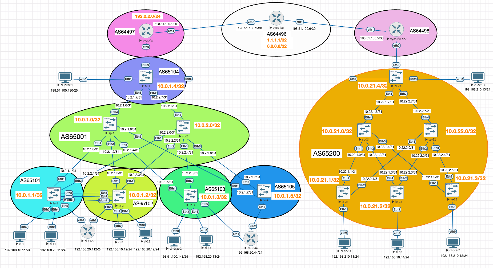

# Разработка сети датацентра на основе технологии VXLAN EVPN

## Цель проекта

Разработать и смоделировать сеть датацентра на базе архитектуры leaf-spine с использованием VXLAN EVPN. Итоговый стенд должен обеспечить L2-связность внутри клиентских VLAN, L3-маршрутизацию между VLAN через L3VNI, распределенный шлюз Anycast Gateway, выход tenant-сетей во внешний сегмент через border leaf и VyOS router/firewall с NAT, а также показать развитие архитектуры до multihoming, отдельного OOB/iDRAC VRF, второго POD/DC и DCI.

## Постановка задачи

В классической сети датацентра расширение L2-сегментов, миграция сервисов и масштабирование клиентских сетей часто требуют ручного протягивания VLAN через большое количество устройств. Это усложняет эксплуатацию, повышает риск ошибки и плохо масштабируется при росте количества стоек, клиентов и площадок.

VXLAN EVPN позволяет отделить физическую underlay-сеть от логической overlay-сети. Underlay отвечает за IP-достижимость между VTEP, а overlay предоставляет клиентские L2/L3-сервисы поверх fabric. Такой подход упрощает масштабирование, позволяет использовать ECMP в leaf-spine топологии и дает основу для дальнейшего расширения: multihoming, border redundancy, DCI и второго датацентра.

## Итоговый стенд

Проект начинался с минимальной схемы на базе lab-06, но финальная версия расширена до двух площадок с DCI, несколькими tenant-сегментами, отказоустойчивыми подключениями клиентов и внешними VyOS edge-устройствами:

| Роль | Количество | Назначение |
|---|---:|---|
| Spine | 4 | 2 spine в DC1 и 2 spine в DC2 |
| Leaf | 7 | 4 leaf в DC1 и 3 leaf в DC2 |
| Border Leaf | 2 | `bl-1` для DC1 edge/DCI и `bl-21` для DC2/DCI |
| VyOS FW | 2 | `vyos-fw` для DC1, `vyos-fw-dc2` для DC2 |
| ISP | 1 | `vyos-isp` как имитация внешнего оператора/интернета |
| Клиентские VLAN | 4 | VLAN 10/20 tenant1, VLAN 30 IDRAC, VLAN 210 DC2 tenant2 |
| Tenant VRF | 3 | `TENANT-1`, `IDRAC`, `TENANT-DC2` |

Базовая часть fabric взята из лабораторной работы lab-06 и затем последовательно расширялась: border leaf, VyOS edge, MLAG, EVPN multihoming, отдельный VRF IDRAC, второй DC/POD, DCI и L2 stretch VLAN 10. Актуальные конфигурации находятся в [configs/bare-metal](configs/bare-metal/) и [configs/clients](configs/clients/).

## Логическая схема

За исходную схему была взята финальная топология lab-06 с дополнительными клиентами:


Финальная стадия проекта: основной DC1 с VXLAN EVPN fabric, border leaf, `vyos-fw`, имитацией ISP на `vyos-isp`, NAT, внешними BGP-фильтрами, MLAG-клиентом, EVPN multihoming-клиентом и отдельным VRF `IDRAC`. Дополнительно собран DC2/POD с OSPF underlay, iBGP EVPN overlay, локальным tenant `TENANT-DC2`, border leaf `bl-21` и DCI до DC1. Через DCI растянут VLAN 10, а клиент `cl-44` в DC2 выходит в интернет через centralized gateway/edge в DC1.



## Используемые технологии

| Слой | Технология | Назначение |
|---|---|---|
| Underlay | eBGP IPv4 | IP-достижимость loopback/VTEP между leaf и spine |
| DC2 Underlay | OSPF | IP-достижимость loopback/VTEP внутри второго POD |
| Overlay control plane | MP-BGP EVPN | Распространение MAC/IP, IMET и IP-prefix маршрутов |
| DC2 Overlay | iBGP EVPN RR | Spine DC2 работают как route-reflector для leaf DC2 |
| DCI Underlay | eBGP IPv4 | IP-достижимость loopback/VTEP между border leaf DC1 и DC2 |
| DCI Overlay | eBGP EVPN | Межплощадочный EVPN control-plane между `bl-1` и `bl-21` |
| Overlay data plane | VXLAN | Инкапсуляция клиентского L2/L3-трафика |
| BGP separation | Underlay/Overlay peer-groups | IPv4-сессии по p2p-адресам, EVPN-сессии по Loopback0 |
| Tenant routing | VRF TENANT-1 | Изоляция клиентских маршрутов |
| OOB routing | VRF IDRAC | Отдельный публичный OOB/iDRAC-сегмент |
| L2 service | L2VNI | Растягивание VLAN поверх fabric |
| L3 service | L3VNI | Маршрутизация между VLAN внутри tenant VRF |
| Gateway | Anycast Gateway | Единый шлюз VLAN на всех leaf |
| Edge | VyOS NAT | Выход tenant-сетей во внешний сегмент |
| Filtering | VyOS firewall, prefix-list, route-map | Ограничение входящего доступа и коррекция BGP-анонсов |
| Custom anycast MAC | `00:00:be:ef:ca:fe`, `00:00:be:ef:dc:02` | Раздельные virtual-router MAC для DC1 и DC2 |
| Client HA | MLAG + LACP | Dual-homed подключение `cl-1122` к паре `le-1`/`le-2` |
| Client HA | EVPN multihoming / ESI-LAG | Dual-homed подключение `cl-3344` к `le-3`/`le-4` без MLAG |
| Failure handling | Link Tracking | Отслеживание uplink/downlink на leaf для отказоустойчивых клиентских портов |

## Адресный план

### ASN

| Устройство | ASN |
|---|---:|
| sp-1, sp-2 | 65001 |
| sp-21, sp-22, le-21, le-22, le-23, bl-21 | 65200 |
| le-1 | 65101 |
| le-2 | 65102 |
| le-3 | 65103 |
| bl-1 | 65104 |
| le-4 | 65105 |
| vyos-fw | 64497 |
| vyos-fw-dc2 | 64498 |
| vyos-isp | 64496 |

### Loopback

| Устройство | Loopback0 |
|---|---|
| sp-1 | 10.0.1.0/32 |
| sp-2 | 10.0.2.0/32 |
| le-1 | 10.0.1.1/32 |
| le-2 | 10.0.1.2/32 |
| le-3 | 10.0.1.3/32 |
| bl-1 | 10.0.1.4/32 |
| le-4 | 10.0.1.5/32 |
| sp-21 | 10.0.21.0/32 |
| sp-22 | 10.0.22.0/32 |
| le-21 | 10.0.21.1/32 |
| le-22 | 10.0.21.2/32 |
| le-23 | 10.0.21.3/32 |
| bl-21 | 10.0.21.4/32 |

### DC1 underlay p2p

| Link | Spine IP | Leaf IP |
|---|---|---|
| sp-1 Ethernet1 <-> le-1 Ethernet1 | 10.2.1.0/31 | 10.2.1.1/31 |
| sp-1 Ethernet2 <-> le-2 Ethernet1 | 10.2.1.2/31 | 10.2.1.3/31 |
| sp-1 Ethernet3 <-> le-3 Ethernet1 | 10.2.1.4/31 | 10.2.1.5/31 |
| sp-2 Ethernet1 <-> le-1 Ethernet2 | 10.2.2.0/31 | 10.2.2.1/31 |
| sp-2 Ethernet2 <-> le-2 Ethernet2 | 10.2.2.2/31 | 10.2.2.3/31 |
| sp-2 Ethernet3 <-> le-3 Ethernet2 | 10.2.2.4/31 | 10.2.2.5/31 |
| sp-1 Ethernet4 <-> bl-1 Ethernet1 | 10.2.1.6/31 | 10.2.1.7/31 |
| sp-2 Ethernet4 <-> bl-1 Ethernet2 | 10.2.2.6/31 | 10.2.2.7/31 |
| sp-1 Ethernet5 <-> le-4 Ethernet1 | 10.2.1.8/31 | 10.2.1.9/31 |
| sp-2 Ethernet5 <-> le-4 Ethernet2 | 10.2.2.8/31 | 10.2.2.9/31 |

### DC2 underlay p2p

| Link | Spine IP | Leaf IP |
|---|---|---|
| sp-21 Ethernet1 <-> le-21 Ethernet1 | 10.22.1.0/31 | 10.22.1.1/31 |
| sp-21 Ethernet2 <-> le-22 Ethernet1 | 10.22.1.2/31 | 10.22.1.3/31 |
| sp-21 Ethernet3 <-> le-23 Ethernet1 | 10.22.1.4/31 | 10.22.1.5/31 |
| sp-21 Ethernet4 <-> bl-21 Ethernet1 | 10.22.1.6/31 | 10.22.1.7/31 |
| sp-22 Ethernet1 <-> le-21 Ethernet2 | 10.22.2.0/31 | 10.22.2.1/31 |
| sp-22 Ethernet2 <-> le-22 Ethernet2 | 10.22.2.2/31 | 10.22.2.3/31 |
| sp-22 Ethernet3 <-> le-23 Ethernet2 | 10.22.2.4/31 | 10.22.2.5/31 |
| sp-22 Ethernet4 <-> bl-21 Ethernet2 | 10.22.2.6/31 | 10.22.2.7/31 |

### DCI p2p

| Link | DC1 IP | DC2 IP | Назначение |
|---|---|---|---|
| bl-1 Ethernet5 <-> bl-21 Ethernet5 | 10.255.0.0/31 | 10.255.0.1/31 | DCI eBGP underlay |

### Tenant-сети

| VLAN | L2VNI | Route Target | Anycast Gateway |
|---:|---:|---|---|
| 10 | 10010 | 10:10010 | 192.168.10.1/24 |
| 20 | 10020 | 20:10020 | 192.168.20.1/24 |
| 30 | 10030 | 30:10030 | 198.51.100.129/25 на `bl-1` |
| 210 | 10210 | 210:10210 | 192.168.210.1/24 |

### Клиенты

| Клиент | VLAN | IP |
|---|---:|---|
| cl-1 | 10 | 192.168.10.11/24 |
| cl-2 | 10 | 192.168.10.12/24 |
| cl-11 | 20 | 192.168.20.11/24 |
| cl-22 | 20 | 192.168.20.12/24 |
| cl-33 | 20 | 192.168.20.13/24 |
| cl-1122 | 20 | 192.168.20.112/24 |
| cl-3344 | 20 | 192.168.20.44/24 |
| cl-idrac-1 | 30 | 198.51.100.130/25 |
| cl-idrac-2 | 30 | 198.51.100.143/25 |
| cl-44 | 10 | 192.168.10.44/24 |
| cl-dc2-1 | 210 | 192.168.210.11/24 |
| cl-dc2-2 | 210 | 192.168.210.12/24 |
| cl-dc2-3 | 210 | 192.168.210.13/24 |

`cl-1122` - VyOS-клиент для демонстрационных проверок. Он подключен к `le-1` и `le-2` через LACP bond `bond0`, использует gateway `192.168.20.1` и может применяться для `curl`/`iperf3` в презентации.

`cl-3344` - VyOS-клиент для проверки EVPN multihoming. Он подключен к `le-3` и `le-4` через LACP bond `bond0`, использует VLAN 20 через `bond0 vif 20`, адрес `192.168.20.44/24` и gateway `192.168.20.1`.

`cl-idrac-2` сделан вместо прежнего клиента `cl-3`: порт на `le-3` переведен из production VLAN 10 в IDRAC VLAN 30.

### L3VNI

| VRF | L3VNI | Route Target |
|---|---:|---|
| TENANT-1 | 50000 | 50000:50000 |
| IDRAC | Не используется | VLAN 30 растянут как L2VNI до gateway на `bl-1` |
| TENANT-DC2 | 50200 | 50200:50200 |

### Внешний контур

| Link | Адресация | Назначение |
|---|---|---|
| bl-1 Ethernet3 <-> vyos-fw eth0 | trunk VLAN 100,130 | Общий физический trunk до external router/firewall |
| VLAN 100 transit | 203.0.113.0/30 | Transit из TENANT-1 до vyos-fw |
| VLAN 130 transit | 203.0.113.4/30 | Transit из IDRAC до vyos-fw |
| vyos-fw eth1 <-> vyos-isp eth0 | 198.51.100.0/30 | Имитация внешнего ISP-сегмента DC1 |
| vyos-fw-dc2 eth1 <-> vyos-isp eth1 | 198.51.100.4/30 | Имитация внешнего ISP-сегмента DC2 |
| DC public prefix | 192.0.2.0/24 | Публичная IPv4-сеть ДЦ, анонсируемая в сторону ISP |
| IDRAC public prefix | 198.51.100.128/25 | Публичная iDRAC/OOB-сеть, анонсируемая в сторону ISP |
| vyos-fw lo | 192.0.2.1/32 | Service public address из сети ДЦ |
| vyos-fw lo | 192.0.2.10/32, 192.0.2.20/32 | Public NAT addresses для VLAN 10 и VLAN 20 |
| vyos-isp lo | 8.8.8.8/32, 1.1.1.1/32 | Имитация интернет |
| NAT source VLAN 10 | 192.168.10.0/24 | Source NAT в 192.0.2.10 на vyos-fw |
| NAT source VLAN 20 | 192.168.20.0/24 | Source NAT в 192.0.2.20 на vyos-fw |
| NAT source VLAN 210 | 192.168.210.0/24 | Source NAT в 198.51.100.5 на vyos-fw-dc2 |

### OOB/iDRAC-сеть

| Сегмент | Адресация | Назначение |
|---|---|---|
| iDRAC/OOB VLAN | VLAN 30, L2VNI 10030 | Out-of-band управление серверами клиента |
| Public client prefix | 198.51.100.128/25 | Белые адреса клиента для management-доступа |
| Gateway | 198.51.100.129/25 | Шлюз VRF `IDRAC` на `bl-1` |
| cl-idrac-1 | 198.51.100.130/25 | iDRAC-клиент напрямую на `bl-1` |
| cl-idrac-2 | 198.51.100.143/25 | iDRAC-клиент через VXLAN fabric на `le-3` |

## DC1 Underlay

DC1 underlay построен на eBGP между leaf и spine. Все межкоммутаторные соединения являются L3 p2p-линками с адресацией `/31`. Underlay BGP-сессии поднимаются по p2p-адресам и используются только для распространения loopback `/32`, необходимых для VTEP и overlay BGP.

`Loopback0` используется как VTEP source-interface для VXLAN, BGP router-id и source-interface для overlay EVPN-сессий. P2P-сети `/31` не распространяются в BGP RIB через `redistribute connected`; вместо этого на каждом устройстве явно анонсируется только свой loopback через `network <loopback>/32`.

Для внешних и публичных сегментов используются диапазоны, зарезервированные для документации и примеров: `192.0.2.0/24`, `198.51.100.0/24`, `203.0.113.0/24`. Это позволяет показать логику public addressing без использования реальных чужих адресов.

На spine используются отдельные BGP listen range для underlay и overlay:

```text
router bgp 65001
   bgp listen range 10.0.0.0/16 peer-group LEAFS-OVERLAY peer-filter PF_LEAFS
   bgp listen range 10.2.0.0/16 peer-group LEAFS-UNDERLAY peer-filter PF_LEAFS
   neighbor LEAFS-OVERLAY peer group
   neighbor LEAFS-OVERLAY update-source Loopback0
   neighbor LEAFS-OVERLAY ebgp-multihop 3
   neighbor LEAFS-OVERLAY send-community extended
   neighbor LEAFS-UNDERLAY peer group
   neighbor LEAFS-UNDERLAY bfd
   neighbor LEAFS-UNDERLAY send-community extended
   !
   address-family evpn
      neighbor LEAFS-OVERLAY activate
   !
   address-family ipv4
      neighbor LEAFS-UNDERLAY activate
      network 10.0.1.0/32
```

На leaf underlay-соседи указываются по p2p-адресам spine, а overlay-соседи - по loopback-адресам spine:

```text
router bgp 65101
   neighbor SPINES-OVERLAY peer group
   neighbor SPINES-OVERLAY remote-as 65001
   neighbor SPINES-OVERLAY update-source Loopback0
   neighbor SPINES-OVERLAY ebgp-multihop 3
   neighbor SPINES-OVERLAY send-community extended
   neighbor SPINES-UNDERLAY peer group
   neighbor SPINES-UNDERLAY remote-as 65001
   neighbor SPINES-UNDERLAY bfd
   neighbor SPINES-UNDERLAY send-community extended
   neighbor 10.0.1.0 peer group SPINES-OVERLAY
   neighbor 10.0.2.0 peer group SPINES-OVERLAY
   neighbor 10.2.1.0 peer group SPINES-UNDERLAY
   neighbor 10.2.2.0 peer group SPINES-UNDERLAY
   !
   address-family evpn
      neighbor SPINES-OVERLAY activate
   !
   address-family ipv4
      neighbor SPINES-UNDERLAY activate
      network 10.0.1.1/32
```

`le-4` добавлен как отдельный leaf в fabric: ASN `65105`, VTEP/Loopback0 `10.0.1.5/32`, uplink к `sp-1` через `10.2.1.9/31` и uplink к `sp-2` через `10.2.2.9/31`. На spine peer-filter расширен до диапазона leaf-AS `65101-65105`.

## Overlay EVPN VXLAN

Overlay использует MP-BGP EVPN для распространения информации о MAC/IP, BUM-доставке и маршрутах tenant VRF. EVPN-соседства строятся между `Loopback0` leaf/border leaf и spine, а не между p2p-адресами. VXLAN-туннели также строятся между VTEP на `Loopback0`.

```text
interface Vxlan1
   vxlan source-interface Loopback0
   vxlan udp-port 4789
   vxlan vlan 10 vni 10010
   vxlan vlan 20 vni 10020
   vxlan vrf TENANT-1 vni 50000
```

Для каждого VLAN создается EVPN instance:

```text
router bgp 65101
   vlan 10
      rd 10.0.1.1:10010
      route-target both 10:10010
      redistribute learned
   !
   vlan 20
      rd 10.0.1.1:10020
      route-target both 20:10020
      redistribute learned
```

## DC2 / POD на OSPF underlay

Второй POD подготовлен и проверен как отдельный fabric с другим underlay-подходом. После автономной проверки DC2 был связан с DC1 через DCI между `bl-1` и `bl-21`.

Состав DC2:

- `sp-21` и `sp-22` - spine и route-reflector для EVPN overlay
- `le-21`, `le-22`, `le-23` - leaf/VTEP
- `bl-21` - border leaf DC2 для DCI и внешнего контура
- `cl-dc2-1`, `cl-dc2-2` и `cl-dc2-3` - клиенты в локальном VLAN 210
- `cl-44` - клиент в VLAN 10, растянутом из DC1 через DCI

Underlay DC2 построен на OSPF area 0. Между spine и leaf используются L3 p2p-сети `/31`, а `Loopback0` каждого устройства является стабильным адресом для VTEP, BGP router-id и overlay-соседств. На p2p-интерфейсах включен OSPF point-to-point и BFD.

Overlay DC2 построен на iBGP EVPN в AS `65200`. Spine `sp-21` и `sp-22` выступают route-reflector, а `le-21`, `le-22`, `le-23` и `bl-21` являются RR-client. Прямое EVPN-соседство между spine не требуется: каждый spine принимает EVPN-маршруты от leaf/border leaf и отражает их другим VTEP в рамках своей RR-функции.

```text
router bgp 65200
   neighbor DC2-LEAFS peer group
   neighbor DC2-LEAFS remote-as 65200
   neighbor DC2-LEAFS update-source Loopback0
   neighbor DC2-LEAFS route-reflector-client
   neighbor DC2-LEAFS send-community extended
   !
   address-family evpn
      neighbor DC2-LEAFS activate
```

Для локального tenant внутри DC2 используется VRF `TENANT-DC2`, VLAN 210, L2VNI 10210 и L3VNI 50200. Gateway `192.168.210.1/24` настроен как anycast gateway на leaf. Этот tenant пока существует только внутри DC2 и не растянут в DC1.

```text
interface Vlan210
   vrf TENANT-DC2
   ip address virtual 192.168.210.1/24
!
interface Vxlan1
   vxlan vlan 210 vni 10210
   vxlan vrf TENANT-DC2 vni 50200
```

Автономная работа DC2 подтверждена проверками OSPF underlay, iBGP EVPN overlay и клиентской связности. Результаты сохранены в [checks/dc2/underlay.md](checks/dc2/underlay.md), [checks/dc2/overlay.md](checks/dc2/overlay.md) и [checks/dc2/pings.md](checks/dc2/pings.md).

`bl-21` добавлен в DC2 как border leaf: он подключен к `sp-21` и `sp-22` через OSPF underlay, имеет VTEP/Loopback0 `10.0.21.4/32`, участвует в iBGP EVPN overlay и подключен к `TENANT-DC2`. Через `bl-21` построен DCI до `bl-1`.

## DCI между DC1 и DC2

DCI сделан отдельным контуром между border leaf `bl-1` и `bl-21`.

- Underlay DCI - eBGP IPv4 по p2p-сети `10.255.0.0/31`.
- Overlay DCI - eBGP EVPN между `Loopback0` `10.0.1.4/32` и `10.0.21.4/32`.
- На `bl-21` используются prefix-list и route-map для обмена VTEP loopback между OSPF underlay DC2 и DCI BGP.
- Первый tenant-сценарий через DCI - L2 stretch VLAN 10/L2VNI 10010 из DC1 в DC2.

```text
bl-1 Ethernet5 10.255.0.0/31 <-> 10.255.0.1/31 bl-21 Ethernet5
bl-1 Loopback0 10.0.1.4/32  <-> 10.0.21.4/32 bl-21 Loopback0
```

На этом этапе `TENANT-1` в DC2 используется как L2 stretch для VLAN 10 без локального L3VNI/SVI на `le-22`. Клиент `cl-44` физически находится в DC2, но использует gateway `192.168.10.1` и anycast MAC `00:00:be:ef:ca:fe` из DC1. Поэтому его выход в интернет идет централизованно через DC1:

```text
cl-44 -> L2VNI 10010 через DCI -> DC1 anycast gateway -> TENANT-1 -> bl-1 -> vyos-fw -> NAT -> vyos-isp
```

## Tenant VRF и Anycast Gateway

Для клиентских сетей используется VRF `TENANT-1`. На каждом leaf настроены одинаковые gateway-адреса VLAN и общий virtual-router MAC. Это позволяет клиентам использовать ближайший leaf как шлюз по умолчанию.

```text
vrf instance TENANT-1
!
ip virtual-router mac-address 00:00:be:ef:ca:fe
!
interface Vlan10
   vrf TENANT-1
   ip address virtual 192.168.10.1/24
!
interface Vlan20
   vrf TENANT-1
   ip address virtual 192.168.20.1/24
```

L3VNI подключает VRF к EVPN overlay:

```text
router bgp 65101
   vrf TENANT-1
      rd 10.0.1.1:50000
      route-target import evpn 50000:50000
      route-target export evpn 50000:50000
      redistribute connected
```

Для anycast gateway в DC1 используется кастомный MAC `00:00:be:ef:ca:fe` (`beef:cafe`). В DC2 для локального tenant `TENANT-DC2` используется отдельный MAC `00:00:be:ef:dc:02`, чтобы визуально разделить gateway разных площадок.

## Border Leaf и внешний контур

Border leaf добавлен как обычный leaf fabric:

- два L3 uplink в сторону `sp-1` и `sp-2`
- свой Loopback0/VTEP
- BGP underlay к spine
- MP-BGP EVPN overlay
- участие в `TENANT-1` и `IDRAC`
- порт `Ethernet3` подключен к `vyos-fw` как trunk с transit VLAN 100 и 130.

Через border leaf tenant VRF получают маршруты наружу. Между `bl-1` и `vyos-fw` используется общий физический trunk и отдельные L3 transit VLAN:

| VRF | VLAN | bl-1 | vyos-fw | Назначение |
|---|---:|---|---|---|
| TENANT-1 | 100 | 203.0.113.1/30 | 203.0.113.2/30 | tenant1 transit |
| IDRAC | 130 | 203.0.113.5/30 | 203.0.113.6/30 | OOB/iDRAC transit |

`vyos-fw` отдает default route в сторону `bl-1` отдельно для `TENANT-1` и `IDRAC`. На `vyos-fw` эти сегменты также разнесены по VRF `TENANT-1` и `IDRAC`, а выход в сторону `vyos-isp` выполняется через route leaking в default/global table.

В сторону fabric применяется route-map `export-to-dc`: во внутренние VRF отдается только `0.0.0.0/0`. Публичный префикс ДЦ и внешние маршруты ISP внутрь tenant VRF не анонсируются.

Путь внешнего трафика DC1:

```text
client -> local leaf -> L3VNI TENANT-1 -> bl-1 -> vyos-fw -> NAT -> vyos-isp loopback
```

## VRF IDRAC

Для out-of-band/iDRAC-доступа добавлен отдельный VRF `IDRAC`, VLAN 30 и L2VNI 10030. В отличие от `TENANT-1`, для IDRAC не используется anycast gateway на всех leaf: шлюз `198.51.100.129/25` расположен на `bl-1` в `Vlan30`.

IDRAC-клиенты:

- `cl-idrac-1` подключен напрямую к `bl-1 Ethernet4`, адрес `198.51.100.130/25`
- `cl-idrac-2` подключен к `le-3 Ethernet3`, адрес `198.51.100.143/25`

`cl-idrac-2` заменил прежний production-клиент `cl-3`: порт `le-3 Ethernet3` переведен в VLAN 30, а VLAN 30 растягивается по fabric через VXLAN L2VNI 10030 до `bl-1`.

Для выхода IDRAC в интернет используется отдельный transit VLAN 130 между `bl-1` и `vyos-fw`. На `vyos-fw` префикс `198.51.100.128/25` анонсируется в сторону `vyos-isp` без NAT, потому что это демонстрационная публичная сеть.

IDRAC-сеть намеренно не закрыта на `vyos-fw` белым списком источников и доступна из имитированного интернета. Это сделано для демонстрации: трафик из production-сети к `198.51.100.143` не маршрутизируется напрямую внутри fabric между VRF, а выходит через `vyos-fw`/`vyos-isp` и возвращается как внешний трафик к публичному IDRAC-префиксу. Это видно по `traceroute` с `cl-3344` и `tcpdump` на `vyos-isp`.

## VyOS NAT

`vyos-fw` выполняет роль внешнего router/firewall. На нем настроены:

- trunk-интерфейс в сторону border leaf
- subinterface `eth0.100` в VRF `TENANT-1`
- subinterface `eth0.130` в VRF `IDRAC`
- интерфейс в сторону условного ISP
- eBGP-соседство с `bl-1` в VRF `TENANT-1`
- eBGP-соседство с `bl-1` в VRF `IDRAC`
- eBGP-соседство с `vyos-isp`
- default route в сторону `vyos-isp`
- анонс публичного префикса ДЦ `192.0.2.0/24` в сторону `vyos-isp`
- анонс IDRAC-префикса `198.51.100.128/25` в сторону `vyos-isp`
- outbound prefix-list/route-map в сторону `vyos-isp`, чтобы наружу анонсировались только разрешенные public prefixes
- outbound prefix-list/route-map в сторону `bl-1`, чтобы внутрь fabric отдавался только default route
- local firewall на внешнем интерфейсе `eth1`: разрешены BGP только от `vyos-isp` и SSH только из `192.0.2.0/24`
- source NAT для `192.168.10.0/24` в адрес `192.0.2.10`
- source NAT для `192.168.20.0/24` в адрес `192.0.2.20`
- route leaking из VRF `TENANT-1` и `IDRAC` в default/global table для выхода к `vyos-isp`
- static routes из default/global table обратно в `TENANT-1` и `IDRAC`
- проверка прохождения трафика из tenant-сетей до loopback-адресов `vyos-isp`.

`vyos-isp` имитирует внешний интернет: на нем подняты loopback-адреса `8.8.8.8/32` и `1.1.1.1/32`, web-сервер и iperf3-сервер. Loopback-адреса анонсируются в сторону `vyos-fw` вместе с default route, а прикладные сервисы запускаются через `simple-http.service` и `iperf3.service`.

Снаружи применяется firewall `OUTSIDE-LOCAL`, повешенный на входящий трафик интерфейса `eth1`. Он разрешает BGP только от `vyos-isp`, SSH только из public-сети ДЦ `192.0.2.0/24`, ICMP для диагностики и established/related трафик. Остальной входящий control-plane трафик на `vyos-fw` с внешнего сегмента отбрасывается.

Для DC2 добавлен отдельный `vyos-fw-dc2`. Он использует AS `64498`, внешний линк к `vyos-isp` через `198.51.100.4/30`, NAT для `192.168.210.0/24` в адрес `198.51.100.5` и VRF `TENANT-DC2` для транзита к `bl-21`.

## Проверка связности

### Underlay

Результаты базовой проверки сохранены в [checks/dc1/underlay.md](checks/dc1/underlay.md). По выводам `show ip bgp summary` все leaf и `bl-1` имеют established IPv4-соседства со spine по p2p-адресам. На spine в IPv4 BGP RIB присутствуют только loopback `/32`, p2p-сети `/31` не распространяются.

```text
show ip bgp summary
```

### Overlay

Результаты проверки сохранены в [checks/dc1/overlay.md](checks/dc1/overlay.md). EVPN-соседства находятся в состоянии `Estab` и строятся по loopback-адресам: leaf видит spine `10.0.1.0`/`10.0.2.0`, а spine видит leaf/border leaf `10.0.1.1`-`10.0.1.5`. В EVPN присутствуют MAC/IP routes Type-2, IMET routes Type-3 и маршруты для multihomed клиента `192.168.20.44`.

```text
show bgp evpn summary
show bgp evpn route-type mac-ip
show bgp evpn route-type imet
```

### Tenant routing

Проверка tenant routing также сохранена в [checks/dc1/overlay.md](checks/dc1/overlay.md). На `le-1` default route установлен в `VRF TENANT-1` через VTEP `10.0.1.4`, L3VNI `50000`, то есть через border leaf `bl-1`.

```text
show ip route vrf TENANT-1
```

### External BGP, firewall и NAT

Результаты внешнего BGP сохранены в [checks/dc1/external-bgp.md](checks/dc1/external-bgp.md). В файле зафиксированы established BGP-сессии `vyos-fw` с `vyos-isp` и `bl-1`, а также проверка advertised-routes в сторону `vyos-isp`: наружу анонсируется только `192.0.2.0/24`.

В [checks/dc1/external-bgp.md](checks/dc1/external-bgp.md) также сохранен вывод received-routes от `vyos-isp`: `0.0.0.0/0`, `1.1.1.1/32`, `8.8.8.8/32` и `192.0.2.0/24`.

Проверка firewall сохранена в [checks/dc1/firewall.md](checks/dc1/firewall.md). С `vyos-isp` проверено, что TCP/179 на `198.51.100.1` доступен, а TCP/22 на `198.51.100.1` недоступен.

### MLAG и EVPN multihoming

Проверка MLAG сохранена в [checks/dc1/mlag.md](checks/dc1/mlag.md). В файле зафиксированы `show mlag interfaces` и `show mlag` на `le-1`/`le-2`: MLAG domain `LEAVES-1-2` находится в состоянии `Active`, peer-link поднят, клиентский `Port-Channel55` для `cl-1122` находится в `active-full`.

Проверка EVPN multihoming сохранена в [checks/dc1/multihoming.md](checks/dc1/multihoming.md). В файле зафиксированы состояние `Port-Channel5` на `le-3`/`le-4`, работа `link tracking group CORE-TRACKING`, EVPN route-type 1 auto-discovery routes, EVPN route-type 4 ethernet-segment routes, состояние LACP bond на `cl-3344`, а также проверки `curl`, `ping` и `iperf3` до `8.8.8.8`.

### VRF IDRAC

Проверка VRF `IDRAC` сохранена в [checks/dc1/VRF IDRAC.md](checks/dc1/VRF%20IDRAC.md). В файле зафиксированы ARP-записи `cl-idrac-1` и `cl-idrac-2` на `bl-1`, ping/traceroute от IDRAC-клиентов до `8.8.8.8`, ping/traceroute от `cl-3344` до `198.51.100.143`, а также `tcpdump` на `vyos-isp`, подтверждающий прохождение traffic path через внешний контур.

### DC2 / автономный POD

Проверки автономного DC2 сохранены в [checks/dc2/underlay.md](checks/dc2/underlay.md), [checks/dc2/overlay.md](checks/dc2/overlay.md) и [checks/dc2/pings.md](checks/dc2/pings.md).

В underlay проверены OSPF-соседства между spine `sp-21`/`sp-22` и leaf `le-21`/`le-22`/`le-23`. Все сохраненные соседства находятся в состоянии `FULL`, что подтверждает IP-достижимость внутри OSPF area 0.

```text
show ip ospf neighbor
```

В overlay проверены iBGP EVPN-соседства: spine `sp-21` и `sp-22` видят leaf `10.0.21.1`, `10.0.21.2`, `10.0.21.3` и border leaf `10.0.21.4`, а leaf видят оба spine route-reflector `10.0.21.0` и `10.0.22.0`. В EVPN RIB присутствуют MAC/IP routes клиентов `192.168.210.11`, `192.168.210.12`, `192.168.210.13`, IMET routes для VNI 10210 и IP-prefix routes `192.168.210.0/24` для L3VNI 50200.

```text
show bgp evpn summary
show bgp evpn
```

На data plane проверены ping между `cl-dc2-1`, `cl-dc2-2`, `cl-dc2-3`, а также доступ клиента до anycast gateway `192.168.210.1`.

```text
cl-dc2-1> ping 192.168.210.12
cl-dc2-2> ping 192.168.210.1
cl-dc2-2> ping 192.168.210.11
cl-dc2-3> ping 192.168.210.11
```

### DCI и VLAN 10 через DCI

Проверка DCI overlay сохранена в [checks/dci-overlay.md](checks/dci-overlay.md). В файле зафиксированы established BGP IPv4-соседства по DCI p2p-сети `10.255.0.0/31` и established EVPN-соседство между `bl-1` и `bl-21` по loopback-адресам.

```text
show ip bgp summary
show bgp evpn summary
show bgp evpn
```

Проверка VLAN 10 через DCI сохранена в [checks/dci-ping vlan 10.md](checks/dci-ping%20vlan%2010.md). На `cl-44` в DC2 проверены ARP gateway `192.168.10.1`, ping до клиента DC1 `192.168.10.12` и ping до `8.8.8.8`. Это подтверждает L2 stretch VLAN 10 и centralized internet breakout через DC1.

```text
cl-44> show arp
cl-44> ping 192.168.10.12
cl-44> ping 8.8.8.8
```

### Data plane

В файлах сохранены следующие проверки:

| Сценарий | Ожидаемый результат |
|---|---|
| cl-33 -> 1.1.1.1 | Ping до loopback на `vyos-isp` успешен |
| cl-2 -> 192.168.20.13 | Межвлановая связность через `TENANT-1` работает |
| cl-1 -> 8.8.8.8 | Trace проходит через gateway, `vyos-fw` и доходит до loopback `vyos-isp` |
| cl-1 -> 1.1.1.1 | Trace проходит через gateway, `vyos-fw` и доходит до loopback `vyos-isp` |
| cl-11 -> 192.168.10.12 | Trace до клиента в VLAN 10 доходит до целевого VPCS |
| cl-33 -> 192.168.10.11 | Trace до клиента в VLAN 10 доходит до целевого VPCS |
| cl-idrac-1 -> 8.8.8.8 | IDRAC-клиент выходит наружу через VRF `IDRAC` и `vyos-fw` |
| cl-idrac-2 -> 8.8.8.8 | IDRAC-клиент через VXLAN L2VNI 10030 выходит наружу через `bl-1` |
| cl-3344 -> 198.51.100.143 | tenant1-клиент достигает IDRAC public prefix через внешний контур |
| cl-dc2-1 -> 192.168.210.12 | Связность клиентов внутри автономного DC2 работает |
| cl-dc2-2 -> 192.168.210.1 | Anycast gateway VLAN 210 в DC2 доступен |
| cl-dc2-3 -> 192.168.210.11 | Клиент за `bl-21` достигает клиента за leaf DC2 |
| cl-44 -> 192.168.10.12 | VLAN 10 растянут между DC1 и DC2 через DCI |
| cl-44 -> 8.8.8.8 | Клиент DC2 выходит в интернет через gateway и edge DC1 |

Результаты ping и trace сохранены в [checks/dc1/pings.md](checks/dc1/pings.md), [checks/dc1/trace.md](checks/dc1/trace.md), [checks/dc1/VRF IDRAC.md](checks/dc1/VRF%20IDRAC.md), [checks/dc2/pings.md](checks/dc2/pings.md) и [checks/dci-ping vlan 10.md](checks/dci-ping%20vlan%2010.md).

## Что реализовано в финальной версии

- Подготовлена VXLAN EVPN fabric на основе lab-06 и расширена до финального проектного стенда.
- Подготовлены проектные конфиги сетевых устройств в [configs/bare-metal](configs/bare-metal/).
- Подготовлены клиентские конфиги в [configs/clients](configs/clients/).
- Добавлен border leaf `bl-1`.
- Добавлен leaf `le-4` для EVPN multihoming-сценария.
- Добавлены конфиги `vyos-fw`, `vyos-fw-dc2` и `vyos-isp`.
- Добавлен VyOS-клиент `cl-1122` в VLAN 20 с dual-homed подключением к `le-1`/`le-2` через MLAG.
- Добавлен VyOS-клиент `cl-3344` в VLAN 20 с dual-homed подключением к `le-3`/`le-4` через EVPN multihoming.
- Добавлен VRF `IDRAC`, VLAN 30, L2VNI 10030 и публичный префикс `198.51.100.128/25`.
- Клиент `cl-3` заменен на `cl-idrac-2` в VLAN 30.
- Добавлены IDRAC-клиенты `cl-idrac-1` и `cl-idrac-2`.
- Используются кастомные anycast MAC: `00:00:be:ef:ca:fe` для DC1 и `00:00:be:ef:dc:02` для DC2.
- Разделены BGP underlay и overlay: IPv4 underlay работает по p2p-соседствам, EVPN overlay работает по `Loopback0`.
- В IPv4 underlay анонсируются только loopback `/32`; p2p `/31` не попадают в BGP RIB.
- Подготовлен и проверен автономный DC2/POD: `sp-21`, `sp-22`, `le-21`, `le-22`, `le-23`, `bl-21`.
- В DC2 underlay построен на OSPF area 0, overlay - на iBGP EVPN с `sp-21`/`sp-22` как route-reflector.
- В DC2 добавлен border leaf `bl-21` с VTEP `10.0.21.4/32` для DCI.
- В DC2 добавлен локальный VRF `TENANT-DC2`, VLAN 210, L2VNI 10210, L3VNI 50200 и клиенты `cl-dc2-1`/`cl-dc2-2`/`cl-dc2-3`.
- Добавлен отдельный роутер `vyos-fw-dc2` для DC2: AS `64498`, ISP-сегмент `198.51.100.4/30`, NAT `192.168.210.0/24` в `198.51.100.5`.
- Построен DCI между `bl-1` и `bl-21`: eBGP IPv4 underlay по `10.255.0.0/31` и eBGP EVPN overlay по loopback.
- VLAN 10 из `TENANT-1` растянут в DC2 как L2VNI 10010; клиент `cl-44` в DC2 пингует клиента DC1 и `8.8.8.8` через centralized gateway/edge в DC1.
- Настроены firewall policy на внешнем интерфейсе `vyos-fw`, route-map для анонса наружу только public `/24` и route-map для отдачи внутрь fabric только default route.
- Собраны проверки underlay, overlay, external BGP, firewall, MLAG, EVPN multihoming, VRF IDRAC, DC2, ping и trace в [checks](checks/).

## Изменения для cl-1122 и MLAG

Для демонстрации прикладного трафика был добавлен VyOS-клиент `cl-1122`. В отличие от простых VPCS-клиентов, он подключен двумя линками к паре leaf `le-1`/`le-2` и использует LACP bond.

На `cl-1122` настроено:

- `bond0` в режиме `802.3ad`
- участники bond: `eth1` в сторону `le-1` и `eth2` в сторону `le-2`
- IP-адрес `192.168.20.112/24`
- default route через `192.168.20.1`

На `le-1` и `le-2` добавлены одинаковые элементы MLAG-пары:

- `vlan 4094` с именем `MLAG-PEERLINK`
- VRF `MGMT` для heartbeat
- `Port-Channel55` для клиента `cl-1122`, access VLAN 20, `mlag 55`
- `Port-Channel78` как peer-link между `le-1` и `le-2`
- `Ethernet5` как member-link к `cl-1122`
- `Ethernet7` и `Ethernet8` как member-link peer-link
- `Vlan4094` с адресами `172.16.101.1/30` на `le-1` и `172.16.101.2/30` на `le-2`
- `Management1` в VRF `MGMT`: `192.168.0.1/30` на `le-1` и `192.168.0.2/30` на `le-2`
- `mlag configuration` с domain-id `LEAVES-1-2`, peer-link `Port-Channel78` и heartbeat через VRF `MGMT`

## Изменения для cl-3344 и EVPN multihoming

Для проверки EVPN multihoming добавлен отдельный leaf `le-4` и новый VyOS-клиент `cl-3344`. В отличие от `cl-1122`, этот клиент подключен не через MLAG-пару, а через EVPN Ethernet Segment между `le-3` и `le-4`.

На `cl-3344` настроено:

- `bond0` в режиме `802.3ad`
- участники bond: `eth1` в сторону `le-3` и `eth2` в сторону `le-4`
- VLAN subinterface `bond0 vif 20`
- IP-адрес `192.168.20.44/24`
- default route через `192.168.20.1`

На `le-3` и `le-4` настроен общий EVPN Ethernet Segment:

- `Port-Channel5` как trunk-порт для клиента `cl-3344`
- `Ethernet5` как LACP member-link к клиенту
- ESI `0000:0000:0000:0000:0001`
- общий `lacp system-id 1111.2222.3333`
- `route-target import 00:00:00:00:00:01`
- DF preference: `50` на `le-3` и `20` на `le-4`
- `link tracking group CORE-TRACKING` для связи состояния core uplink и downstream client-link

## Сложности при выполнении

Предыдущие лабораторные работы выполнялись в одной общей EVE-NG лаборатории. Для проекта стенд был собран отдельно: конфигурации lab-06 использовались как база, но устройства запустились пустыми и настраивались заново.

- Виртуальные клиенты в EVE-NG периодически зависали и не всегда запускались с первого раза. Из-за этого часть проверок приходилось повторять после перезапуска клиентских узлов.
- При использовании команды `shutdown` на интерфейсах leaf в сторону MLAG-клиента поведение лабораторной не всегда соответствовало ожидаемому: несмотря на выключение интерфейса, в дампе всё равно наблюдался трафик.
- При ребуте spine обнаружилось, что при схеме с `bgp listen range`, где spine ожидает входящие BGP-сессии от leaf, разница во времени установления соседств может быть до 1 минуты:
```
sp-2#show ip bgp su
BGP summary information for VRF default
Router identifier 10.0.2.0, local AS number 65001
Neighbor Status Codes: m - Under maintenance
  Neighbor V AS           MsgRcvd   MsgSent  InQ OutQ  Up/Down State   PfxRcd PfxAcc
  10.2.2.1 4 65101             26        16    0    0 00:00:14 Estab   1      1
  10.2.2.3 4 65102             52        47    0    0 00:01:19 Estab   1      1
  10.2.2.5 4 65103             26        20    0    0 00:00:14 Estab   1      1
```
- При поднятии peer-link между `le-1` и `le-2` была случайно собрана петля. Проблема проявилась не сразу по конфигурации, а по поведению клиентского трафика: появились задержки порядка 400-580 мс и периодические потери ICMP.
```
84 bytes from 192.168.10.11 icmp_seq=30 ttl=63 time=461.701 ms
192.168.10.11 icmp_seq=31 timeout
84 bytes from 192.168.10.11 icmp_seq=32 ttl=63 time=453.198 ms
192.168.10.11 icmp_seq=33 timeout
192.168.10.11 icmp_seq=34 timeout
84 bytes from 192.168.10.11 icmp_seq=35 ttl=63 time=536.489 ms
192.168.10.11 icmp_seq=36 timeout
84 bytes from 192.168.10.11 icmp_seq=37 ttl=63 time=482.023 ms
84 bytes from 192.168.10.11 icmp_seq=38 ttl=63 time=519.976 ms

```
- При установлении соседства с ISP ему анонсировались все внутренние маршруты. Сначала стоит расписывать route-map, а уже после поднимать соседство. Были добавлены необходимые фильтры.

## Шпаргалка для презентации

Команды для демонстрации прикладной связности через VXLAN EVPN fabric, border leaf, `vyos-fw`, NAT и внешний сегмент `vyos-isp`.

### Эволюция схемы

Показать развитие стенда по картинкам:

- [img/eve-ng-scheme.png](img/eve-ng-scheme.png) - исходная схема лабораторной.
- [img/eve-ng-scheme-mvp.png](img/eve-ng-scheme-mvp.png) - первый минимальный вариант проекта на базе lab-06.
- [img/eve-ng-scheme2.png](img/eve-ng-scheme2.png) - базовый VXLAN EVPN fabric с клиентами.
- [img/eve-ng-scheme3.png](img/eve-ng-scheme3.png) - добавление border leaf, `vyos-fw`, `vyos-isp`, NAT и внешнего BGP.
- [img/eve-ng-scheme4.png](img/eve-ng-scheme4.png) - добавление MLAG, EVPN multihoming и VRF `IDRAC`.
- [img/eve-ng-scheme5.png](img/eve-ng-scheme5.png) - развитие DC1 с отдельными клиентскими сценариями.
- [img/eve-ng-scheme6.png](img/eve-ng-scheme6.png) - автономный DC2/POD на OSPF underlay и iBGP EVPN.
- [img/eve-ng-scheme7.png](img/eve-ng-scheme7.png) - DCI между DC1 и DC2 через border leaf.
- [img/eve-ng-scheme8.png](img/eve-ng-scheme8.png) - финальная схема проекта.

### Iperf

На `vyos-isp` запустить сервер:

```bash
vyos@vyos-isp:/var/www/html$ sudo systemctl start iperf3.service
vyos@vyos-isp:/var/www/html$ iperf3 -s
```


На клиентских VyOS `cl-1122` и `cl-3344` запустить тест до loopback-адреса `8.8.8.8`:

```bash
iperf3 -c 8.8.8.8 -P 4 -b 4M -t 20
```

### HTTP

На `vyos-isp` запустить простой web-сервер:

```bash
vyos@vyos-isp:/var/www/html$ cd /var/www/html
vyos@vyos-isp:/var/www/html$ sudo systemctl start simple-http.service
vyos@vyos-isp:/var/www/html$ sudo python3 -m http.server 80
```

На клиентских VyOS `cl-1122` и `cl-3344`  проверить доступ через HTTP:

```bash
curl http://8.8.8.8:80/
```

### IDRAC через внешний контур

На `vyos-isp` запустить `tcpdump`, чтобы показать, что трафик из production VRF к public IDRAC-сети проходит через внешний контур, а не маршрутизируется напрямую внутри fabric:

```bash
vyos@vyos-isp:~$ sudo tcpdump -ni eth0 host 198.51.100.143
```

На клиентском VyOS `cl-3344` проверить ICMP и трассировку до IDRAC-клиента `198.51.100.143`:

```bash
vyos@cl-3344:~$ sudo ping -c 4 198.51.100.143
vyos@cl-3344:~$ traceroute 198.51.100.143
```

## Что не удалось внедрить в финальную версию

- Резервирование border leaf не реализовано: в каждом DC используется по одному border leaf (`bl-1` и `bl-21`).
- DCI между DC1 и DC2 построен одним линком `bl-1` <-> `bl-21`; резервный DCI path и ECMP для межплощадочного контура не добавлены.
- Для `TENANT-1` в DC2 проверен L2 stretch VLAN 10, но локальный L3VNI/SVI для `TENANT-1` в DC2 не внедрялся.
- Внешний выход DC2 сделан через `vyos-fw-dc2`, но отказоустойчивый edge DC2 не доведен до уровня отдельного HA-сценария.
- EVPN multihoming реализован для одного клиента `cl-3344`; расширенные failure-сценарии с отказом целого leaf можно добавить отдельно.
- IDRAC public prefix намеренно доступен из имитированного интернета без whitelist на `vyos-fw`, чтобы наглядно показать внешний путь трафика.
- В DC2 не выделялась отдельная публичная сеть `/24`: NAT для VLAN 210 выполняется в адрес из линковочной public-подсети `198.51.100.4/30`.
- Шлюз IDRAC `198.51.100.129/25` не отказоустойчивый: он расположен только на `bl-1`.

## Возможные расширения после защиты

### Доработка DC2 и DCI

Развить межплощадочный сценарий: добавить резервный DCI path, расширить проверки отказов и довести внешний выход DC2 до отдельного проверенного edge-сценария.

### Резервирование выхода наружу

Добавить второй border leaf или второй uplink к VyOS/ISP, настроить резервный default route и проверить отказ внешнего линка.

## Вывод

Итоговая архитектура на базе VXLAN EVPN закрывает основную задачу проекта: предоставляет масштабируемую L2/L3-связность внутри датацентра, отделяет клиентские сервисы от физической топологии underlay и создает основу для дальнейшего роста. Добавление border leaf и VyOS превращает лабораторную overlay-сеть в более законченный контур датацентра с внешней связностью и NAT.
